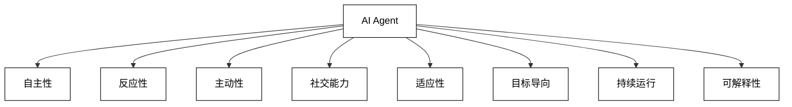
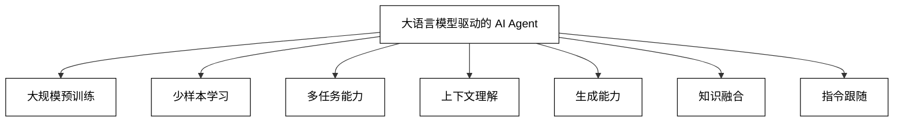
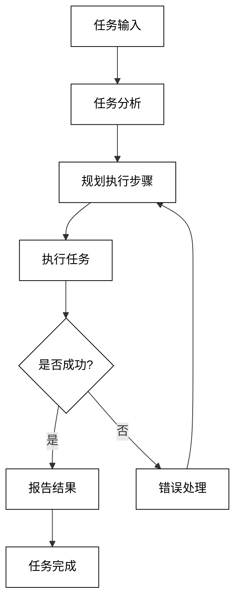
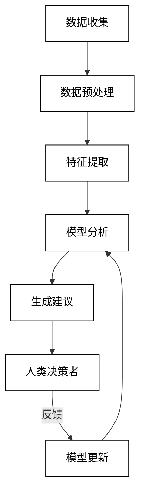
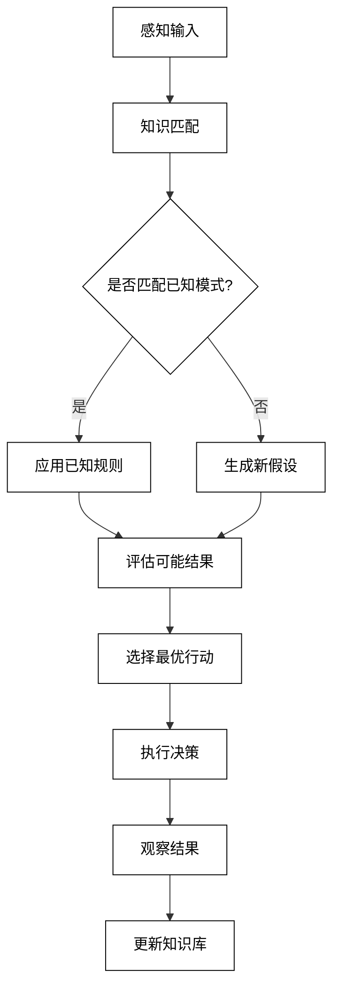
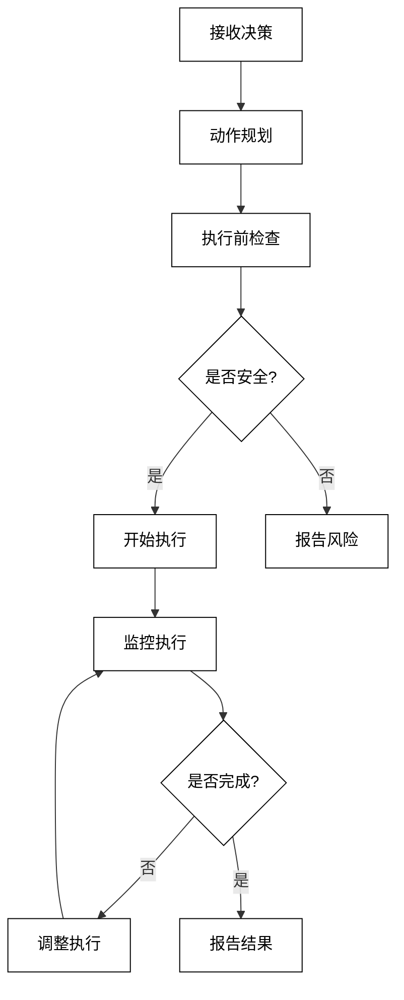

# 第一部分：AI Agent 基础

# 第1章：AI Agent 概述

## 1.1 什么是 AI Agent

### 1.1.1 AI Agent 的定义

AI Agent（人工智能代理）是一种能够感知环境、做出决策并采取行动以实现特定目标的智能系统。它是人工智能研究和应用的核心概念之一，代表了一种能够自主运作、适应环境并解决复杂问题的智能实体。

从技术角度来看，AI Agent 可以定义为：

一个由软件和/或硬件组成的系统，它能够：
1. 感知环境状态
2. 根据预设目标和内部知识做出决策
3. 执行行动以改变环境或达成目标
4. 学习并适应新的情况

数学表示：
一个 AI Agent 可以表示为一个函数 $f$：

$f: P \times K \rightarrow A$

其中：
- $P$ 表示环境感知（Perception）
- $K$ 表示知识库（Knowledge）
- $A$ 表示行动（Action）

这个函数描述了 AI Agent 如何根据环境感知和内部知识来决定采取何种行动。

### 1.1.2 AI Agent 的特征

AI Agent 具有以下关键特征：

1. 自主性（Autonomy）：能够在没有直接人类干预的情况下独立运作。

2. 反应性（Reactivity）：能够及时感知环境变化并做出响应。

3. 主动性（Proactivity）：不仅被动响应，还能主动采取行动以实现目标。

4. 社交能力（Social Ability）：能与其他 Agent 或人类进行交互和协作。

5. 适应性（Adaptability）：能够学习并适应新的环境和情况。

6. 目标导向（Goal-oriented）：所有行为都是为了实现预定的目标。

7. 持续运行（Continuous Operation）：能够持续不断地执行任务。

8. 可解释性（Explainability）：能够解释其决策和行为的原因。

这些特征可以用以下 Mermaid 图表来表示：



### 1.1.3 AI Agent 与传统 AI 系统的区别

AI Agent 与传统 AI 系统有几个关键区别：

1. 自主性程度：
    - AI Agent：高度自主，能独立做决策和执行任务。
    - 传统 AI：通常需要更多人类干预和控制。

2. 环境交互：
    - AI Agent：持续与环境交互，能适应变化。
    - 传统 AI：往往在固定环境中运行，适应性较差。

3. 学习能力：
    - AI Agent：通常具有在线学习能力，可以从经验中改进。
    - 传统 AI：学习能力有限，通常依赖离线训练。

4. 目标设定：
    - AI Agent：可以处理复杂、长期的目标。
    - 传统 AI：通常针对特定、短期的任务优化。

5. 多任务处理：
    - AI Agent：能够处理多样化的任务，具有通用性。
    - 传统 AI：往往专注于单一或有限范围的任务。

6. 决策过程：
    - AI Agent：决策过程更复杂，考虑多个因素。
    - 传统 AI：决策通常基于预定义的规则或简单模型。

7. 社交能力：
    - AI Agent：能与其他 Agent 或人类进行复杂交互。
    - 传统 AI：交互能力有限，通常是单向的。

比较表格：

| 特性 | AI Agent | 传统 AI 系统 |
|------|----------|--------------|
| 自主性 | 高 | 低 |
| 环境适应性 | 强 | 弱 |
| 学习能力 | 持续学习 | 有限/固定 |
| 目标复杂度 | 高 | 低 |
| 任务范围 | 广泛 | 专注 |
| 决策复杂度 | 高 | 低 |
| 社交能力 | 强 | 弱 |

这些区别使得 AI Agent 更适合处理复杂、动态和长期的任务，而传统 AI 系统则更适合特定、稳定的应用场景。随着技术的发展，AI Agent 正在逐步取代传统 AI 系统，成为人工智能研究和应用的主流方向。

## 1.2 AI Agent 的发展历程

### 1.2.1 早期 AI Agent 研究

AI Agent 的概念可以追溯到人工智能研究的早期阶段。以下是早期 AI Agent 研究的关键里程碑：

1. 1950年代：赛博网络学（Cybernetics）
    - 诺伯特·维纳（Norbert Wiener）提出了反馈控制系统的概念，为 AI Agent 的自适应行为奠定了基础。

2. 1956年：达特茅斯会议
    - 人工智能领域正式诞生，研究者开始探索能够模拟人类智能的计算机程序。

3. 1960年代：通用问题求解器（GPS）
    - 艾伦·纽厄尔（Allen Newell）和赫伯特·西蒙（Herbert Simon）开发了 GPS，这是早期 AI Agent 的一个重要原型。

4. 1970年代：专家系统
    - 基于规则的 AI 系统开始流行，如 MYCIN 和 DENDRAL，这些系统可以看作是早期的领域特定 AI Agent。

5. 1980年代：行为型 AI
    - 罗德尼·布鲁克斯（Rodney Brooks）提出了"包容架构"（Subsumption Architecture），强调 AI 应该直接与环境交互，而不是依赖复杂的内部表示。

早期 AI Agent 研究的特点：
- 符号处理：主要基于符号逻辑和规则推理
- 中央控制：采用集中式的决策机制
- 领域特定：针对特定问题域设计
- 有限感知：环境感知能力有限
- 静态知识：知识库通常是预先定义的，缺乏学习能力

```mermaid
timeline
    title AI Agent 早期发展时间线
    1950 : 赛博网络学
    1956 : 达特茅斯会议
    1960 : 通用问题求解器(GPS)
    1970 : 专家系统
    1980 : 行为型 AI

%% 自定义样式
classDef default fill:#ffffff,stroke:#000000,color:#000000;
```

### 1.2.2 机器学习时代的 AI Agent

随着机器学习技术的发展，AI Agent 进入了新的阶段：

1. 1990年代：强化学习
    - 理查德·萨顿（Richard Sutton）和安德鲁·巴尔托（Andrew Barto）的工作推动了强化学习的发展，使 AI Agent 能够通过与环境交互来学习最优策略。

2. 2000年代初：统计机器学习
    - 支持向量机（SVM）、决策树等算法的广泛应用，提高了 AI Agent 的分类和预测能力。

3. 2000年代中期：概率图模型
    - 贝叶斯网络和马尔可夫决策过程的应用，使 AI Agent 能够更好地处理不确定性。

4. 2010年代：深度学习革命
    - 深度神经网络在各种任务上取得突破性进展，大大提升了 AI Agent 的感知和决策能力。

5. 2015年后：端到端学习
    - 从原始输入直接学习到最终输出的方法，简化了 AI Agent 的设计流程。

机器学习时代 AI Agent 的特点：
- 数据驱动：依赖大量数据进行训练
- 自适应：能够从经验中学习和改进
- 概率模型：更好地处理不确定性
- 分布式表示：使用向量空间来表示知识
- 端到端优化：减少人工特征工程的需求

### 1.2.3 大语言模型驱动的 AI Agent

近年来，大语言模型（LLM）的出现开创了 AI Agent 发展的新纪元：

1. 2018年：BERT 的诞生
    - Google 发布的 BERT 模型展示了预训练语言模型的强大能力，为后续 LLM 的发展奠定了基础。

2. 2020年：GPT-3 的突破
    - OpenAI 发布的 GPT-3 模型展示了惊人的自然语言处理能力，开启了大规模语言模型的新时代。

3. 2022年：ChatGPT 的爆发
    - OpenAI 发布的 ChatGPT 展示了类人的对话能力，引发了全球范围内对 AI Agent 的广泛关注。

4. 2023年：多模态大模型
    - 如 GPT-4 等模型开始整合文本、图像等多种模态的信息，进一步扩展了 AI Agent 的能力边界。

5. 2023年及以后：Agent 生态系统
    - 基于 LLM 的各种专业化 Agent 开始涌现，如编程助手、创意生成器、决策支持系统等。

LLM 驱动的 AI Agent 特点：
- 大规模预训练：利用海量文本数据进行预训练
- 少样本学习：能够快速适应新任务，无需大量标注数据
- 多任务能力：单一模型可以处理多种不同类型的任务
- 上下文理解：能够理解和利用长文本上下文
- 生成能力：不仅可以理解输入，还能生成高质量的文本输出
- 知识融合：在预训练过程中融合了大量世界知识
- 指令跟随：能够理解并执行自然语言指令



LLM 驱动的 AI Agent 代表了当前 AI 技术的最前沿，它们正在重塑我们与计算机交互的方式，并在各个领域带来革命性的变革。然而，这也带来了新的挑战，如模型的可解释性、偏见控制、隐私保护等问题，这些都是未来研究的重要方向。

## 1.3 AI Agent 的应用场景

AI Agent 的应用范围非常广泛，几乎涵盖了所有需要智能决策和自动化的领域。以下是一些主要的应用场景：

### 1.3.1 智能助手

智能助手是 AI Agent 最常见和最直接的应用之一。它们能够理解自然语言指令，执行各种任务，并与用户进行自然对话。

主要特点：
- 自然语言交互
- 多领域知识整合
- 个性化服务
- 24/7 可用性

应用示例：
1. 个人助理：如 Siri、Google Assistant、Alexa
2. 客户服务机器人：处理客户查询、投诉和支持请求
3. 虚拟秘书：管理日程、安排会议、处理邮件
4. 智能家居控制：通过语音命令控制家电设备

代码示例（使用 Python 和 OpenAI API 创建简单的智能助手）：

```python
import openai

openai.api_key = 'your_api_key_here'

def smart_assistant(user_input):
    response = openai.Completion.create(
        engine="text-davinci-002",
        prompt=f"Human: {user_input}\nAI:",
        max_tokens=150
    )
    return response.choices[0].text.strip()

# 使用示例
while True:
    user_input = input("You: ")
    if user_input.lower() == 'exit':
        break
    response = smart_assistant(user_input)
    print("AI:", response)
```

### 1.3.2 自动化任务执行

AI Agent 可以自动执行各种复杂的任务，从简单的数据处理到复杂的决策制定。

主要特点：
- 高效率和准确性
- 24/7 不间断运行
- 可扩展性强
- 能处理重复性任务

应用示例：
1. 自动化测试：软件开发中的自动化测试
2. 流程自动化：企业业务流程自动化（RPA）
3. 智能调度：物流配送路线优化
4. 金融交易：算法交易和风险管理

自动化任务执行的流自动化任务执行的流程图可以用以下 Mermaid 图表表示：



代码示例（使用 Python 实现简单的自动化任务执行器）：

```python
import time

class AutomationAgent:
    def __init__(self):
        self.tasks = []

    def add_task(self, task):
        self.tasks.append(task)

    def execute_tasks(self):
        for task in self.tasks:
            print(f"执行任务: {task}")
            time.sleep(1)  # 模拟任务执行时间
            print(f"任务 {task} 完成")

    def run(self):
        print("开始自动化任务执行")
        self.execute_tasks()
        print("所有任务执行完毕")

# 使用示例
agent = AutomationAgent()
agent.add_task("数据备份")
agent.add_task("系统更新")
agent.add_task("日志分析")
agent.run()
```

### 1.3.3 决策支持系统

AI Agent 可以通过分析大量数据，为人类决策者提供有价值的洞察和建议。

主要特点：
- 数据驱动决策
- 快速处理大量信息
- 考虑多个因素和场景
- 持续学习和优化

应用示例：
1. 医疗诊断辅助：分析患者数据，提供诊断建议
2. 投资组合管理：根据市场数据推荐投资策略
3. 供应链优化：预测需求，优化库存和物流
4. 风险评估：在保险和信贷领域评估风险

决策支持系统的工作流程：



代码示例（使用 Python 实现简单的决策支持系统）：

```python
import random

class DecisionSupportSystem:
    def __init__(self):
        self.data = []

    def collect_data(self, new_data):
        self.data.extend(new_data)

    def analyze_data(self):
        if not self.data:
            return "没有足够的数据进行分析"
        
        average = sum(self.data) / len(self.data)
        if average > 7:
            return "建议：执行计划A"
        elif average > 4:
            return "建议：执行计划B"
        else:
            return "建议：执行计划C"

    def make_decision(self):
        analysis = self.analyze_data()
        print(f"基于当前数据分析：{analysis}")
        return analysis

# 使用示例
dss = DecisionSupportSystem()

# 模拟数据收集
for _ in range(10):
    dss.collect_data([random.randint(1, 10)])

decision = dss.make_decision()
```

## 1.4 AI Agent 的核心组件

AI Agent 的设计通常包含几个核心组件，这些组件共同工作以实现智能行为。以下是 AI Agent 的主要核心组件：

### 1.4.1 感知模块

感知模块负责从环境中收集信息，是 AI Agent 与外界交互的主要接口。

主要功能：
- 数据采集：从各种传感器或数据源获取原始数据
- 信号处理：对原始数据进行滤波、降噪等预处理
- 特征提取：从处理后的数据中提取有用的特征
- 模式识别：识别数据中的特定模式或对象

示例（使用 OpenCV 进行图像感知）：

```python
import cv2
import numpy as np

class PerceptionModule:
    def __init__(self):
        self.camera = cv2.VideoCapture(0)

    def capture_image(self):
        ret, frame = self.camera.read()
        return frame

    def process_image(self, image):
        # 转换为灰度图
        gray = cv2.cvtColor(image, cv2.COLOR_BGR2GRAY)
        # 边缘检测
        edges = cv2.Canny(gray, 100, 200)
        return edges

    def detect_objects(self, image):
        # 简单的物体检测（这里仅作示例）
        contours, _ = cv2.findContours(image, cv2.RETR_EXTERNAL, cv2.CHAIN_APPROX_SIMPLE)
        return len(contours)

    def perceive(self):
        image = self.capture_image()
        processed_image = self.process_image(image)
        num_objects = self.detect_objects(processed_image)
        return num_objects

# 使用示例
perception = PerceptionModule()
num_objects = perception.perceive()
print(f"检测到 {num_objects} 个物体")
```

### 1.4.2 推理与决策模块

推理与决策模块是 AI Agent 的"大脑"，负责处理感知信息，做出判断和决策。

主要功能：
- 知识表示：将信息组织成易于推理的形式
- 推理引擎：基于知识和规则进行逻辑推理
- 决策制定：评估不同选项，选择最优行动
- 学习更新：根据经验更新知识和决策策略

推理与决策过程可以用以下 Mermaid 图表表示：



示例（使用简单的规则引擎进行推理和决策）：

```python
class InferenceEngine:
    def __init__(self):
        self.rules = {
            "下雨": "带伞",
            "晴天": "戴太阳镜",
            "寒冷": "穿厚衣服"
        }

    def infer(self, conditions):
        actions = []
        for condition in conditions:
            if condition in self.rules:
                actions.append(self.rules[condition])
        return actions if actions else ["无特殊行动"]

class DecisionModule:
    def __init__(self):
        self.inference_engine = InferenceEngine()

    def make_decision(self, perceptions):
        inferred_actions = self.inference_engine.infer(perceptions)
        return inferred_actions

# 使用示例
decision_maker = DecisionModule()
perceptions = ["下雨", "寒冷"]
actions = decision_maker.make_decision(perceptions)
print(f"基于当前感知 {perceptions}，决定采取以下行动：{actions}")
```

### 1.4.3 执行模块

执行模块负责将决策转化为实际的行动，与环境进行交互。

主要功能：
- 动作规划：将高级决策转化为具体的动作序列
- 运动控制：控制执行器（如机器人关节）执行动作
- 反馈处理：处理执行过程中的反馈，进行实时调整
- 安全监控：确保执行的动作不会造成危险或损害

执行模块的工作流程：



示例（模拟机器人执行模块）：

```python
import time

class ExecutionModule:
    def __init__(self):
        self.position = [0, 0]  # 机器人当前位置

    def move(self, direction, distance):
        if direction == "上":
            self.position[1] += distance
        elif direction == "下":
            self.position[1] -= distance
        elif direction == "左":
            self.position[0] -= distance
        elif direction == "右":
            self.position[0] += distance
        
        print(f"移动 {direction} {distance} 单位")
        time.sleep(1)  # 模拟执行时间
        print(f"当前位置: {self.position}")

    def execute_plan(self, plan):
        for action in plan:
            direction, distance = action
            self.move(direction, distance)

# 使用示例
executor = ExecutionModule()
plan = [("上", 2), ("右", 3), ("下", 1)]
executor.execute_plan(plan)
```

### 1.4.4 学习与适应模块

学习与适应模块使 AI Agent 能够从经验中学习，不断改进其性能。

主要功能：
- 经验收集：记录 Agent 的行动及其结果
- 模式识别：从经验中识别有用的模式
- 知识更新：根据新的经验更新知识库
- 策略优化：调整决策策略以提高性能

学习过程可以用以下公式表示：

$Q(s, a) \leftarrow Q(s, a) + \alpha [r + \gamma \max_{a'} Q(s', a') - Q(s, a)]$

其中：
- $Q(s, a)$ 是在状态 $s$ 下采取行动 $a$ 的价值
- $\alpha$ 是学习率
- $r$ 是即时奖励
- $\gamma$ 是折扣因子
- $s'$ 是下一个状态

示例（使用 Q-learning 实现简单的强化学习）：

```python
import numpy as np

class QLearningAgent:
    def __init__(self, states, actions, learning_rate=0.1, discount_factor=0.9, epsilon=0.1):
        self.q_table = np.zeros((states, actions))
        self.learning_rate = learning_rate
        self.discount_factor = discount_factor
        self.epsilon = epsilon

    def get_action(self, state):
        if np.random.random() < self.epsilon:
            return np.random.randint(self.q_table.shape[1])
        else:
            return np.argmax(self.q_table[state, :])

    def learn(self, state, action, reward, next_state):
        predict = self.q_table[state, action]
        target = reward + self.discount_factor * np.max(self.q_table[next_state, :])
        self.q_table[state, action] += self.learning_rate * (target - predict)

# 使用示例
agent = QLearningAgent(states=10, actions=4)

# 模拟学习过程
for _ in range(1000):
    state = np.random.randint(10)
    action = agent.get_action(state)
    reward = np.random.random()
    next_state = np.random.randint(10)
    agent.learn(state, action, reward, next_state)

print("学习后的 Q 表：")
print(agent.q_table)
```

这些核心组件共同工作，使 AI Agent 能够感知环境、做出决策、执行行动并从经验中学习。每个组件都可以根据具体应用进行定制和优化，以满足不同场景的需求。在实际系统中，这些组件往往是紧密集成的，形成一个连贯的智能系统。

随着技术的发展，特别是大语言模型的出现，这些组件的实现方式正在发生变革。例如，大语言模型可以同时承担感知（理解自然语言输入）、推理决策（基于上下文生成响应）和执行（生成行动计划）的功能。这种整合为创建更加灵活和强大的 AI Agent 提供了新的可能性。