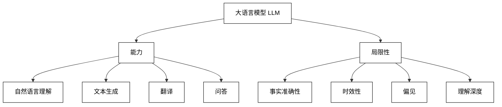
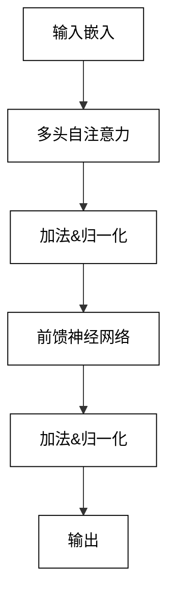
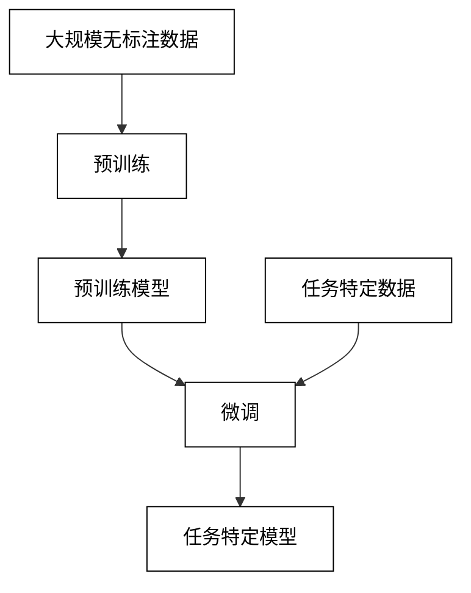
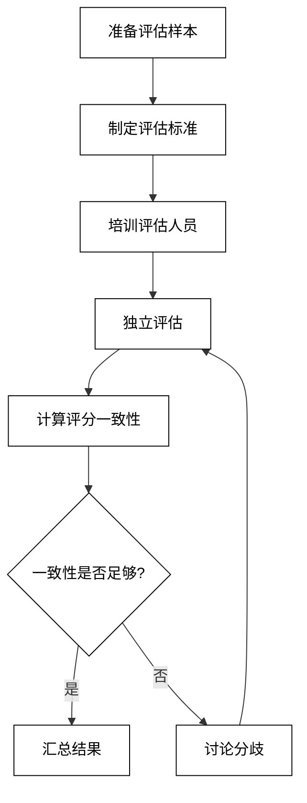

# 第2章：大语言模型（LLM）基础

## 2.1 LLM 概述

### 2.1.1 LLM 的定义与特点

大语言模型（Large Language Models，LLMs）是一类基于深度学习技术，通过海量文本数据训练而成的自然语言处理模型。它们能够理解、生成和操纵人类语言，展现出近乎人类水平的语言能力。

LLM 的主要特点包括：

1. 规模巨大：通常包含数十亿到数万亿个参数。
2. 自监督学习：主要通过预测下一个词的任务进行训练，无需大量标注数据。
3. 上下文学习：能够理解和利用长文本上下文信息。
4. 少样本学习：能够快速适应新任务，无需大量针对性训练数据。
5. 多任务能力：单一模型可以执行多种不同类型的自然语言处理任务。
6. 涌现能力：随着规模增大，展现出一些意想不到的新能力。

LLM 的基本工作原理可以用以下数学公式简要表示：

给定输入序列 $x = (x_1, ..., x_t)$，LLM 预测下一个词的概率分布：

$P(x_{t+1}|x_1, ..., x_t) = \text{softmax}(W h_t + b)$

其中 $h_t$ 是模型的隐藏状态，$W$ 和 $b$ 是可学习的参数。

### 2.1.2 主流 LLM 模型介绍

目前，主流的 LLM 模型主要包括：

1. GPT（Generative Pre-trained Transformer）系列
    - 由 OpenAI 开发
    - 代表模型：GPT-3, GPT-4
    - 特点：强大的文本生成能力，广泛的知识覆盖

2. BERT（Bidirectional Encoder Representations from Transformers）系列
    - 由 Google 开发
    - 代表模型：BERT, RoBERTa
    - 特点：双向上下文理解，适合各种自然语言理解任务

3. T5（Text-to-Text Transfer Transformer）
    - 由 Google 开发
    - 特点：将所有 NLP 任务统一为文本到文本的转换

4. LaMDA（Language Model for Dialogue Applications）
    - 由 Google 开发
    - 特点：专门针对对话应用进行优化

5. PaLM（Pathways Language Model）
    - 由 Google 开发
    - 特点：使用新的 Pathways 系统训练，展现出强大的推理能力

6. LLaMA（Large Language Model Meta AI）
    - 由 Meta（原 Facebook）开发
    - 特点：开源模型，在较小规模下也能展现出强大性能

比较表格：

| 模型 | 开发者 | 参数规模 | 主要特点 | 适用场景 |
|------|--------|----------|----------|----------|
| GPT-3 | OpenAI | 175B | 强大的生成能力 | 文本生成、对话、翻译 |
| BERT | Google | 340M | 双向上下文理解 | 文本分类、问答、情感分析 |
| T5 | Google | 11B | 统一的文本到文本框架 | 多任务 NLP |
| LaMDA | Google | 137B | 对话优化 | 聊天机器人、对话系统 |
| PaLM | Google | 540B | 强大的推理能力 | 复杂问题解决、代码生成 |
| LLaMA | Meta | 65B | 开源、高效 | 研究、定制应用 |

### 2.1.3 LLM 的能力与局限性

LLM 展现出了许多令人印象深刻的能力，但同时也存在一些局限性。

能力：

1. 自然语言理解：理解复杂的语言结构和语义。
2. 文本生成：生成连贯、流畅的文本。
3. 翻译：在不同语言之间进行高质量翻译。
4. 问答：回答各种领域的问题。
5. 摘要生成：对长文本进行准确摘要。
6. 代码生成：根据自然语言描述生成代码。
7. 创意写作：生成诗歌、故事等创意内容。
8. 逻辑推理：进行简单的逻辑推理和问题解决。

局限性：

1. 事实准确性：可能生成虚假或不准确的信息。
2. 时效性：知识截止于训练数据的时间点。
3. 偏见：可能反映训练数据中的偏见。
4. 理解深度：对深层语义和隐含信息的理解有限。
5. 常识推理：在需要常识的任务上可能表现不佳。
6. 长期一致性：在长对话中保持一致性存在挑战。
7. 数学能力：复杂数学问题的解决能力有限。
8. 隐私和安全：可能无意中泄露训练数据中的敏感信息。

LLM 能力和局限性的可视化：



## 2.2 LLM 的工作原理

### 2.2.1 Transformer 架构

Transformer 架构是现代 LLM 的基础，它由 Vaswani 等人在 2017 年提出，通过自注意力机制实现了并行处理和长距离依赖建模。

Transformer 的核心组件：

1. 编码器（Encoder）：处理输入序列
2. 解码器（Decoder）：生成输出序列
3. 多头自注意力（Multi-Head Self-Attention）：捕捉序列内部的依赖关系
4. 前馈神经网络（Feed-Forward Neural Network）：增加模型的非线性变换能力
5. 层归一化（Layer Normalization）：稳定训练过程
6. 残差连接（Residual Connection）：缓解梯度消失问题

Transformer 架构图：



### 2.2.2 自注意力机制

自注意力机制是 Transformer 的核心，它允许模型在处理序列时考虑所有位置的信息。

自注意力的计算过程：

1. 对输入序列计算查询（Query）、键（Key）和值（Value）
2. 计算注意力分数：$\text{Score}(Q, K) = \frac{QK^T}{\sqrt{d_k}}$
3. 应用 softmax 函数获得注意力权重
4. 加权求和得到输出：$\text{Attention}(Q, K, V) = \text{softmax}(\frac{QK^T}{\sqrt{d_k}})V$

多头注意力通过并行计算多个自注意力，然后拼接结果，增加了模型的表达能力：

$\text{MultiHead}(Q, K, V) = \text{Concat}(\text{head}_1, ..., \text{head}_h)W^O$

其中 $\text{head}_i = \text{Attention}(QW_i^Q, KW_i^K, VW_i^V)$

### 2.2.3 预训练与微调

LLM 的训练通常分为两个阶段：预训练和微调。

预训练：
- 目标：学习通用的语言表示
- 数据：大规模无标注文本数据
- 任务：通常是下一词预测或掩码语言模型
- 特点：计算密集，需要大量计算资源

预训练损失函数（以下一词预测为例）：

$L = -\sum_{i} \log P(x_i|x_{<i})$

微调：
- 目标：适应特定任务或领域
- 数据：针对特定任务的标注数据
- 任务：各种下游 NLP 任务，如分类、问答等
- 特点：基于预训练模型，需要较少的数据和计算资源

微调过程可以表示为：

$\theta_t = \theta_{t-1} - \alpha \nabla_{\theta} L(\theta)$

其中 $\theta$ 是模型参数，$\alpha$ 是学习率，$L$ 是任务特定的损失函数。

预训练和微调的过程可以用以下图表示：



## 2.3 LLM 的应用方式

### 2.3.1 零样本学习

零样本学习（Zero-shot Learning）是 LLM 的一种强大能力，它允许模型在没有见过特定任务的训练样本的情况下，直接执行该任务。

原理：
- 利用模型在预训练阶段获得的广泛知识
- 通过自然语言指令引导模型执行任务

示例（使用 OpenAI API 进行零样本分类）：

```python
import openai

openai.api_key = 'your_api_key_here'

def zero_shot_classification(text, categories):
    prompt = f"请将以下文本分类到这些类别之一：{', '.join(categories)}。\n\n文本：{text}\n\n类别："
    
    response = openai.Completion.create(
        engine="text-davinci-002",
        prompt=prompt,
        max_tokens=10,
        n=1,
        stop=None,
        temperature=0.5,
    )
    
    return response.choices[0].text.strip()

# 使用示例
text = "苹果公司发布了新款 iPhone，引起了消费者的广泛关注。"
categories = ["科技", "娱乐", "体育", "政治"]

result = zero_shot_classification(text, categories)
print(f"分类结果：{result}")
```

### 2.3.2 少样本学习

少样本学习（Few-shot Learning）允许 LLM 通过少量示例快速适应新任务。

原理：
- 在提示中包含几个任务示例
- 模型通过模式识别理解任务要求

示例（使用 OpenAI API 进行少样本情感分析）：

```python
import openai

openai.api_key = 'your_api_key_here'

def few_shot_sentiment_analysis(text):
    prompt = """
    请判断以下评论的情感倾向。

    评论：这部电影太棒了，我非常喜欢！
    情感：积极

    评论：服务态度很差，再也不会光顾了。
    情感：消极

    评论：这本书还行，但不算特别出色。
    情感：中性

    评论：""" + text + """
    情感：
    """
    
    response = openai.Completion.create(
        engine="text-davinci-002",
        prompt=prompt,
        max_tokens=10,
        n=1,
        stop=None,
        temperature=0.5,
    )
    
    return response.choices[0].text.strip()

# 使用示例
text = "这家餐厅的食物味道一般，但是环境很好。"
result = few_shot_sentiment_analysis(text)
print(f"情感分析结果：{result}")
```

### 2.3.3 提示工程

提示工程（Prompt Engineering）是优化 LLM 输入以获得更好输出的技术。

关键技巧：
1. 明确指令：清晰、具体地说明任务要求
2. 提供上下文：包含相关背景信息
3. 示例演示：提供高质量的示例
4. 结构化输出：指定所需的输出格式
5. 思维链：引导模型逐步思考

示例（使用提示工程改进文本摘要）：

```python
import openai

openai.api_key = 'your_api_key_here'

def improved_summarization(text):
    prompt = f"""
    请按照以下步骤为给定的文本生成一个简洁的摘要：
    1. 识别文本的主要主题
    2. 提取关键信息点（不超过3个）
    3. 用一到两句话总结主要内容
    4. 确保摘要清晰、准确，并保持中立的语气

    文本：
    {text}

    摘要：
    """
    
    response = openai.Completion.create(
        engine="text-davinci-002",
        prompt=prompt,
        max_tokens=150,
        n=1,
        stop=None,
        temperature=0.7,
    )
    
    return response.choices[0].text.strip()

# 使用示例
long_text = """
人工智能（AI）正在迅速改变各个行业的面貌。在医疗领域，AI 辅助诊断系统能够快速分析医学影像，提高疾病检测的准确性。在金融sector，机器学习算法被用于预测市场趋势和识别欺诈行为。教育方面，个性化学习平台利用 AI 技术为学生提供量身定制的学习计划。然而，AI 的广泛应用也带来了一系列挑战，如隐私保护、算法偏见和就业市场变革等问题。专家们呼吁，在推进 AI 技术发展的同时，也要注重制定相关的伦理准则和监管框架。
"""

summary = improved_summarization(long_text)
print(f"生成的摘要：\n{summary}")
```

## 2.4 LLM 评估指标

评估 LLM 的性能是一个复杂的任务，需要考虑多个方面。以下是一些常用的评估指标：

### 2.4.1 困惑度（Perplexity）

困惑度是评估语言模型质量的一个基本指标，它衡量模型对测试集的预测能力。

数学定义：
$\text{PPL} = \exp(-\frac{1}{N}\sum_{i=1}^N \log p(x_i|x_{<i}))$

其中，$N$ 是序列长度，$p(x_i|x_{<i})$ 是模型对第 $i$ 个词的预测概率。

特点：
- 越低越好
- 适用于比较同类型的模型
- 不直接反映实际任务性能

Python 实现示例：

```python
import numpy as np

def calculate_perplexity(probabilities):
    return np.exp(-np.mean(np.log(probabilities)))

# 假设这是模型对一个序列中每个词的预测概率
word_probabilities = [0.1, 0.2, 0.05, 0.3, 0.15]
perplexity = calculate_perplexity(word_probabilities)
print(f"Perplexity: {perplexity}")
```

### 2.4.2 BLEU 分数

BLEU（Bilingual Evaluation Understudy）主要用于评估机器翻译质量，但也可用于其他文本生成任务。

计算步骤：
1. 计算 n-gram 精确度
2. 应用简短惩罚
3. 计算几何平均值

数学表达：
$\text{BLEU} = \text{BP} \cdot \exp(\sum_{n=1}^N w_n \log p_n)$

其中，$\text{BP}$ 是简短惩罚因子，$w_n$ 是权重，$p_n$ 是 n-gram 精确度。

特点：
- 范围从 0 到 1，越高越好
- 考虑了词序
- 可能对流畅性不够敏感

Python 实现示例（使用 NLTK 库）：

```python
from nltk.translate.bleu_score import sentence_bleu

reference = [['这', '是', '一个', '测试', '句子']]
candidate = ['这', '是', '一个', '测试']

score = sentence_bleu(reference, candidate)
print(f"BLEU score: {score}")
```

### 2.4.3 人工评估方法

尽管自动评估指标很有用，但人工评估仍然是评估 LLM 输出质量的重要方法。

常用人工评估维度：
1. 流畅性（Fluency）：输出的语言是否自然流畅
2. 相关性（Relevance）：内容是否与输入/任务相关
3. 一致性（Coherence）：各部分是否逻辑一致
4. 信息性（Informativeness）：是否提供了有用的信息
5. 创造性（Creativity）：对于创意任务，评估创新程度
6. 事实准确性（Factual Accuracy）：生成的信息是否准确

评分标准示例：

| 分数 | 描述 |
|------|------|
| 5 | 优秀 - 完全满足要求，无明显缺陷 |
| 4 | 良好 - 基本满足要求，有minor缺陷 |
| 3 | 一般 - 部分满足要求，有明显缺陷 |
| 2 | 差 - 勉强满足要求，有重大缺陷 |
| 1 | 很差 - 完全不满足要求 |

人工评估流程：



实施人工评估的注意事项：
1. 确保评估人员的多样性，以减少偏见
2. 使用双盲评估，避免先入为主的判断
3. 定期检查评分一致性，必要时进行再培训
4. 结合定量和定性反馈，以获得全面的评估结果
5. 考虑使用众包平台扩大评估规模，但要注意质量控制

评估结果分析示例代码：

```python
import numpy as np
from scipy import stats

def analyze_human_evaluation(scores):
    mean_score = np.mean(scores)
    median_score = np.median(scores)
    std_dev = np.std(scores)
    
    # 计算评分者间一致性（使用肯德尔和谐系数）
    kendall_w = stats.kendalltau(scores).correlation
    
    print(f"平均分: {mean_score:.2f}")
    print(f"中位数: {median_score:.2f}")
    print(f"标准差: {std_dev:.2f}")
    print(f"评分者间一致性 (Kendall's W): {kendall_w:.2f}")
    
    # 绘制分数分布直方图
    import matplotlib.pyplot as plt
    plt.hist(scores, bins=5, range=(1,6), align='left')
    plt.title("评分分布")
    plt.xlabel("分数")
    plt.ylabel("频次")
    plt.show()

# 使用示例
scores = [4, 5, 3, 4, 5, 4, 3, 4, 5, 4]
analyze_human_evaluation(scores)
```

综合使用自动评估指标和人工评估方法，可以全面地评估 LLM 的性能。自动指标提供了快速、可重复的评估手段，而人工评估则能捕捉到更细微的质量差异。在实际应用中，应根据具体任务和资源情况，选择合适的评估策略。

随着 LLM 技术的不断发展，评估方法也在不断演进。未来可能会出现更加精细和全面的评估框架，以更好地衡量 LLM 在各种复杂任务中的表现。同时，如何评估 LLM 的安全性、公平性和道德性也将成为重要的研究方向。