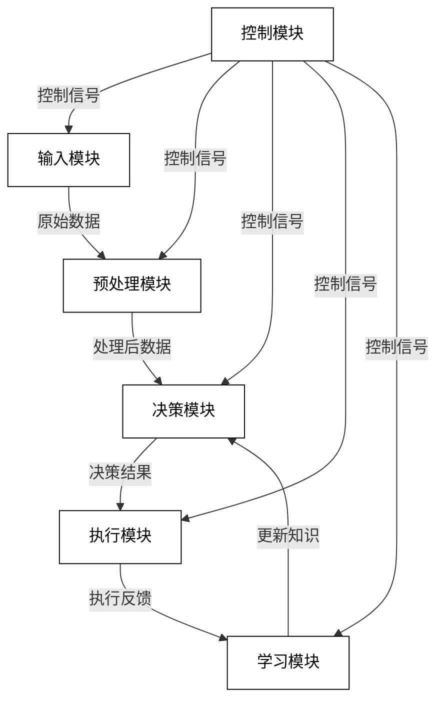
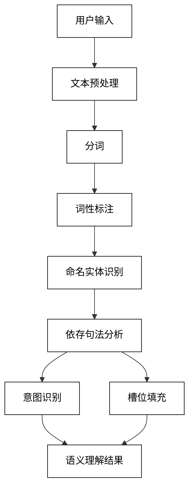
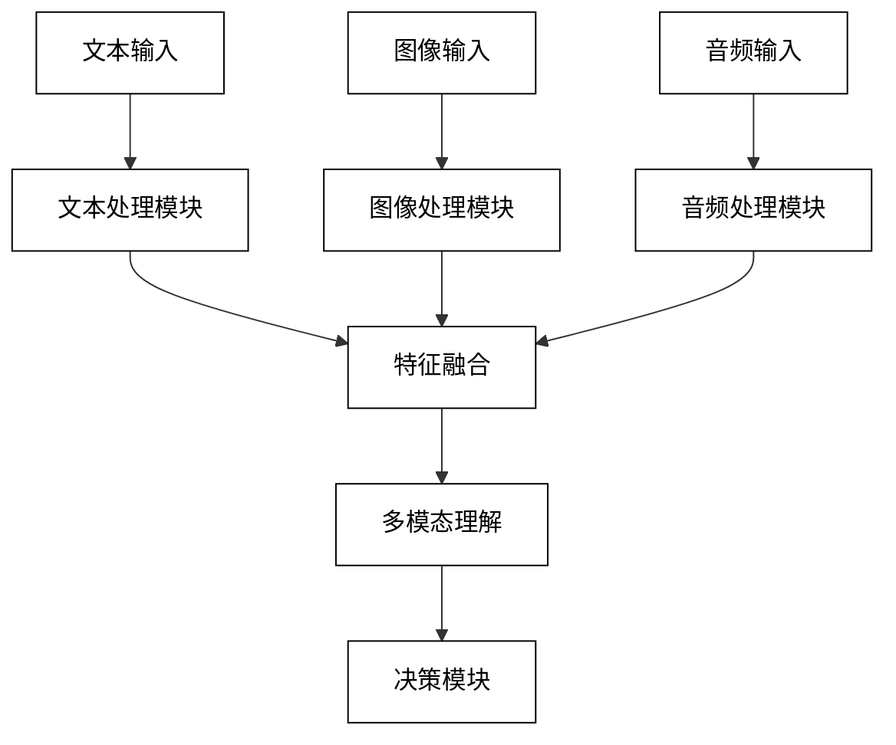
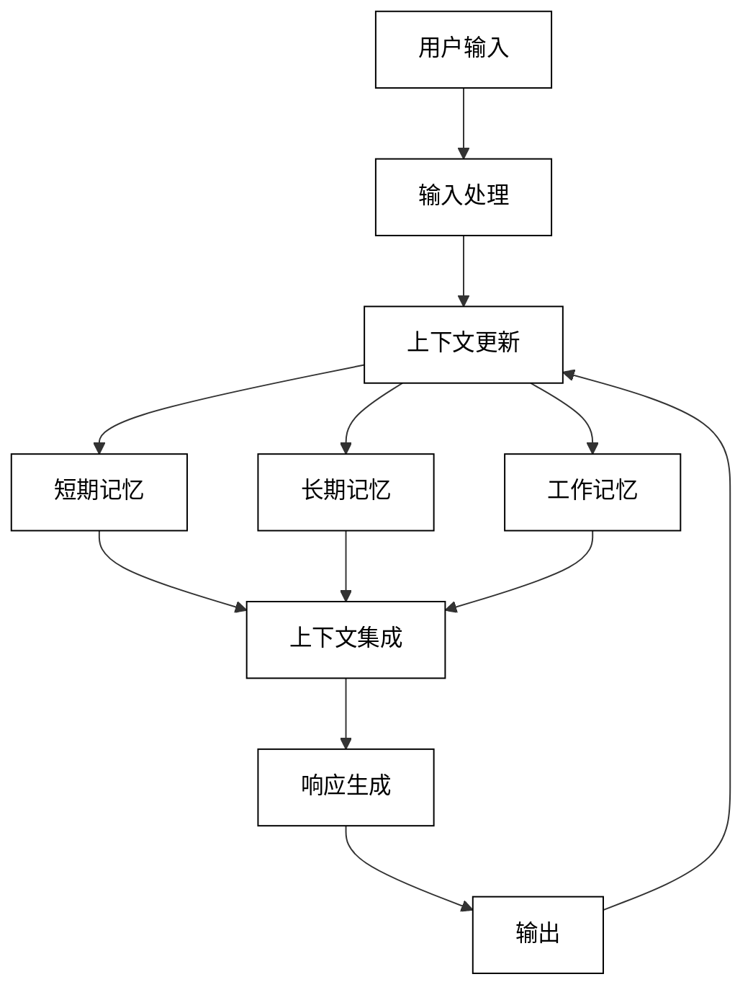

# 第二部分：AI Agent 设计与实现

# 第3章：AI Agent 架构设计

## 3.1 AI Agent 总体架构

### 3.1.1 模块化设计原则

模块化设计是 AI Agent 架构的核心原则，它有助于提高系统的可维护性、可扩展性和复用性。主要原则包括：

1. 单一职责原则：每个模块只负责一个特定的功能。
2. 高内聚低耦合：模块内部元素紧密相关，模块之间相对独立。
3. 接口标准化：定义清晰的模块间接口，便于集成和替换。
4. 可配置性：允许通过配置文件或参数调整模块行为。
5. 可测试性：每个模块都可以独立测试。

模块化设计的优势：
- 简化开发和维护
- 便于团队协作
- 支持增量开发和迭代
- 提高代码复用率
- 便于性能优化和故障排除

### 3.1.2 数据流与控制流

AI Agent 的数据流和控制流设计是确保系统高效运行的关键。

数据流设计原则：
1. 最小化数据传输：减少模块间不必要的数据传输。
2. 数据一致性：确保在不同模块间传递的数据格式一致。
3. 缓存机制：在适当的位置使用缓存，提高数据访问速度。
4. 异步处理：对于耗时的数据处理操作，考虑使用异步方式。

控制流设计原则：
1. 事件驱动：使用事件驱动架构，提高系统的响应性。
2. 状态管理：清晰定义和管理 Agent 的状态转换。
3. 错误处理：实现健壮的错误处理和恢复机制。
4. 并发控制：合理设计并发处理，提高系统吞吐量。

数据流与控制流示意图：



### 3.1.3 可扩展性考虑

设计具有可扩展性的 AI Agent 架构对于应对未来需求变化至关重要。主要考虑点包括：

1. 插件化架构：允许通过插件方式添加新功能。
2. 微服务设计：将大型系统拆分为独立的微服务。
3. 负载均衡：实现动态负载均衡，支持水平扩展。
4. API 版本控制：设计支持多版本的 API，便于平滑升级。
5. 数据存储扩展：选择可扩展的数据存储解决方案。
6. 计算资源弹性：支持动态调整计算资源。

可扩展性设计示例（使用 Python 的抽象基类）：

```python
from abc import ABC, abstractmethod

class InputProcessor(ABC):
    @abstractmethod
    def process(self, data):
        pass

class TextInputProcessor(InputProcessor):
    def process(self, data):
        return data.lower()

class ImageInputProcessor(InputProcessor):
    def process(self, data):
        # 假设这里有图像处理逻辑
        return "processed_image"

class AIAgent:
    def __init__(self):
        self.input_processors = {}

    def register_processor(self, data_type, processor):
        self.input_processors[data_type] = processor

    def process_input(self, data_type, data):
        if data_type in self.input_processors:
            return self.input_processors[data_type].process(data)
        else:
            raise ValueError(f"No processor registered for {data_type}")

# 使用示例
agent = AIAgent()
agent.register_processor("text", TextInputProcessor())
agent.register_processor("image", ImageInputProcessor())

print(agent.process_input("text", "Hello World"))
print(agent.process_input("image", "raw_image_data"))
```

## 3.2 输入处理模块

### 3.2.1 自然语言理解

自然语言理解（NLU）是 AI Agent 与用户交互的关键组件。它负责解析和理解用户的自然语言输入。

主要任务：
1. 意图识别：确定用户的目的或意图。
2. 实体提取：识别输入中的关键信息单元。
3. 语义解析：理解输入的深层含义。
4. 情感分析：识别用户的情感状态。

NLU 流程：



示例代码（使用 spaCy 进行 NLU）：

```python
import spacy

class NLUModule:
    def __init__(self):
        self.nlp = spacy.load("en_core_web_sm")

    def process(self, text):
        doc = self.nlp(text)
        
        # 实体提取
        entities = [(ent.text, ent.label_) for ent in doc.ents]
        
        # 依存关系分析
        dependencies = [(token.text, token.dep_, token.head.text) for token in doc]
        
        # 简单的意图识别（基于规则）
        intent = "unknown"
        if any(token.lower_ in ["what", "who", "where", "when", "why", "how"] for token in doc):
            intent = "question"
        elif any(token.lower_ in ["please", "could", "would"] for token in doc):
            intent = "request"
        
        return {
            "intent": intent,
            "entities": entities,
            "dependencies": dependencies
        }

# 使用示例
nlu = NLUModule()
result = nlu.process("What is the weather like in New York today?")
print(result)
```

### 3.2.2 多模态输入处理

多模态输入处理允许 AI Agent 处理文本、图像、音频等多种类型的输入，从而提供更丰富的交互体验。

主要挑战：
1. 模态融合：整合不同模态的信息。
2. 跨模态学习：利用一个模态的信息改善对另一个模态的理解。
3. 对齐问题：确保不同模态的信息在时间或空间上对齐。
4. 缺失模态处理：当某些模态的数据缺失时，仍能进行有效处理。

多模态处理架构：



示例代码（多模态输入处理框架）：

```python
from abc import ABC, abstractmethod

class ModalityProcessor(ABC):
    @abstractmethod
    def process(self, data):
        pass

class TextProcessor(ModalityProcessor):
    def process(self, data):
        # 假设这里有文本处理逻辑
        return {"type": "text", "features": data.lower()}

class ImageProcessor(ModalityProcessor):
    def process(self, data):
        # 假设这里有图像处理逻辑
        return {"type": "image", "features": "image_features"}

class AudioProcessor(ModalityProcessor):
    def process(self, data):
        # 假设这里有音频处理逻辑
        return {"type": "audio", "features": "audio_features"}

class MultimodalFusion:
    def fuse(self, modality_outputs):
        # 简单的特征拼接
        fused_features = []
        for output in modality_outputs:
            fused_features.extend(output["features"])
        return fused_features

class MultimodalInputProcessor:
    def __init__(self):
        self.processors = {
            "text": TextProcessor(),
            "image": ImageProcessor(),
            "audio": AudioProcessor()
        }
        self.fusion_module = MultimodalFusion()

    def process(self, inputs):
        modality_outputs = []
        for modality, data in inputs.items():
            if modality in self.processors:
                output = self.processors[modality].process(data)
                modality_outputs.append(output)
        
        fused_output = self.fusion_module.fuse(modality_outputs)
        return fused_output

# 使用示例
processor = MultimodalInputProcessor()
inputs = {
    "text": "Hello world",
    "image": "image_data",
    "audio": "audio_data"
}
result = processor.process(inputs)
print(result)
```

### 3.2.3 上下文管理

上下文管理是确保 AI Agent 能够进行连贯对话和任务执行的关键。它涉及存储、更新和检索与当前交互相关的信息。

主要功能：
1. 对话历史跟踪：记录用户和 Agent 之间的交互历史。
2. 会话状态维护：跟踪当前会话的状态，如进行中的任务。
3. 用户偏好记忆：存储用户的长期偏好和设置。
4. 上下文相关信息检索：根据当前上下文检索相关信息。

上下文管理策略：
1. 短期记忆：存储最近的交互信息。
2. 长期记忆：存储持久化的用户信息和知识。
3. 工作记忆：存储当前任务相关的临时信息。

上下文管理流程：



示例代码（简单的上下文管理系统）：

```python
class ContextManager:
    def __init__(self, max_history=5):
        self.short_term_memory = []
        self.long_term_memory = {}
        self.working_memory = {}
        self.max_history = max_history

    def update_context(self, user_input, agent_response):
        # 更新短期记忆
        self.short_term_memory.append((user_input, agent_response))
        if len(self.short_term_memory) > self.max_history:
            self.short_term_memory.pop(0)

        # 更新工作记忆（示例：提取实体）
        entities = self.extract_entities(user_input)
        self.working_memory.update(entities)

    def get_context(self):
        return {
            "short_term": self.short_term_memory,
            "long_term": self.long_term_memory,
            "working": self.working_memory
        }

    def update_long_term_memory(self, key, value):
        self.long_term_memory[key] = value

    def extract_entities(self, text):
        # 这里应该有更复杂的实体提取逻辑
        # 这只是一个简单的示例
        entities = {}
        if "name" in text.lower():
            entities["user_name"] = "John"  # 假设提取到的名字
        return entities

# 使用示例
context_manager = ContextManager()

# 模拟对话
context_manager.update_context("Hi, my name is Alice", "Hello Alice, how can I help you?")
context_manager.update_context("What's the weather like today?", "It's sunny today in your location.")
context_manager.update_long_term_memory("user_preference", {"language": "English", "units": "metric"})

print(context_manager.get_context())
```

这个上下文管理系统允许 AI Agent 跟踪对话历史、维护会话状态，并存储长期用户偏好。在实际应用中，可能需要更复杂的实体提取和关系推理机制，以及与外部知识库的集成，以提供更智能和个性化的交互体验。## 3.3 任务规划模块

任务规划模块是 AI Agent 智能决策的核心，负责将用户的高级指令转化为可执行的具体步骤。

### 3.3.1 目标分解

目标分解是将复杂任务拆分为更小、更易管理的子任务的过程。

主要步骤：
1. 任务分析：理解任务的整体目标和约束条件。
2. 层次分解：将任务分解为多个层次的子任务。
3. 依赖识别：确定子任务之间的依赖关系。
4. 并行机会识别：找出可以并行执行的子任务。

目标分解示例（使用树形结构）：

```python
class Task:
    def __init__(self, name, subtasks=None):
        self.name = name
        self.subtasks = subtasks or []

    def add_subtask(self, subtask):
        self.subtasks.append(subtask)

    def display(self, level=0):
        print("  " * level + self.name)
        for subtask in self.subtasks:
            subtask.display(level + 1)

# 创建任务层次结构
plan_trip = Task("Plan a trip")
plan_trip.add_subtask(Task("Choose destination"))
transportation = Task("Arrange transportation")
transportation.add_subtask(Task("Book flights"))
transportation.add_subtask(Task("Rent car"))
plan_trip.add_subtask(transportation)
plan_trip.add_subtask(Task("Book accommodation"))
plan_trip.add_subtask(Task("Plan activities"))

# 显示任务结构
plan_trip.display()
```

### 3.3.2 任务优先级排序

任务优先级排序确保 AI Agent 以最有效的顺序执行任务。

排序考虑因素：
1. 紧急性：任务的时间敏感度。
2. 重要性：任务对整体目标的贡献度。
3. 依赖关系：考虑任务间的前置条件。
4. 资源可用性：当前可用资源对任务执行的影响。

优先级排序算法示例：

```python
import heapq

class PrioritizedTask:
    def __init__(self, task, priority):
        self.task = task
        self.priority = priority

    def __lt__(self, other):
        return self.priority > other.priority

class TaskPrioritizer:
    def __init__(self):
        self.task_queue = []

    def add_task(self, task, priority):
        heapq.heappush(self.task_queue, PrioritizedTask(task, priority))

    def get_next_task(self):
        if self.task_queue:
            return heapq.heappop(self.task_queue).task
        return None

# 使用示例
prioritizer = TaskPrioritizer()
prioritizer.add_task("Respond to urgent email", 10)
prioritizer.add_task("Prepare presentation", 5)
prioritizer.add_task("Schedule team meeting", 3)

# 获取优先级最高的任务
next_task = prioritizer.get_next_task()
print(f"Next task to execute: {next_task}")
```

### 3.3.3 资源分配

资源分配涉及将可用资源（如计算能力、内存、时间）分配给各个任务，以确保高效执行。

资源分配策略：
1. 静态分配：预先为每个任务分配固定资源。
2. 动态分配：根据任务的实时需求和系统负载动态调整资源。
3. 优先级基础分配：根据任务优先级分配更多资源给重要任务。
4. 公平分享：确保所有任务都能获得最低限度的资源。

资源分配器示例：

```python
class Resource:
    def __init__(self, name, capacity):
        self.name = name
        self.capacity = capacity
        self.allocated = 0

    def allocate(self, amount):
        if self.allocated + amount <= self.capacity:
            self.allocated += amount
            return True
        return False

    def release(self, amount):
        self.allocated = max(0, self.allocated - amount)

class ResourceAllocator:
    def __init__(self):
        self.resources = {}

    def add_resource(self, name, capacity):
        self.resources[name] = Resource(name, capacity)

    def allocate_resources(self, task, requirements):
        allocated = {}
        for resource_name, amount in requirements.items():
            if resource_name in self.resources:
                if self.resources[resource_name].allocate(amount):
                    allocated[resource_name] = amount
                else:
                    # 回滚已分配的资源
                    for alloc_name, alloc_amount in allocated.items():
                        self.resources[alloc_name].release(alloc_amount)
                    return False
            else:
                return False
        return True

# 使用示例
allocator = ResourceAllocator()
allocator.add_resource("CPU", 100)
allocator.add_resource("Memory", 1000)

task1_req = {"CPU": 20, "Memory": 200}
task2_req = {"CPU": 30, "Memory": 300}

if allocator.allocate_resources("Task1", task1_req):
    print("Resources allocated for Task1")
else:
    print("Failed to allocate resources for Task1")

if allocator.allocate_resources("Task2", task2_req):
    print("Resources allocated for Task2")
else:
    print("Failed to allocate resources for Task2")
```

## 3.4 知识检索模块

知识检索模块使 AI Agent 能够从大规模知识库中快速检索相关信息，支持决策和响应生成。

### 3.4.1 知识库设计

知识库设计关注如何组织和存储知识，以支持高效检索和更新。

关键考虑点：
1. 知识表示：选择适当的知识表示方法（如语义网络、框架、规则等）。
2. 存储结构：设计支持快速检索的存储结构（如图数据库、向量数据库）。
3. 元数据管理：维护知识的来源、可信度、时效性等元数据。
4. 版本控制：跟踪知识的变更历史，支持回滚和审计。

知识库结构示例（使用简化的图结构）：

```python
class KnowledgeNode:
    def __init__(self, id, content, type):
        self.id = id
        self.content = content
        self.type = type
        self.relations = {}

    def add_relation(self, relation_type, target_node):
        if relation_type not in self.relations:
            self.relations[relation_type] = []
        self.relations[relation_type].append(target_node)

class KnowledgeBase:
    def __init__(self):
        self.nodes = {}

    def add_node(self, node):
        self.nodes[node.id] = node

    def get_node(self, node_id):
        return self.nodes.get(node_id)

    def add_relation(self, source_id, relation_type, target_id):
        source = self.get_node(source_id)
        target = self.get_node(target_id)
        if source and target:
            source.add_relation(relation_type, target)

# 使用示例
kb = KnowledgeBase()

# 添加节点
kb.add_node(KnowledgeNode("1", "Python", "Programming Language"))
kb.add_node(KnowledgeNode("2", "Object-Oriented", "Programming Paradigm"))
kb.add_node(KnowledgeNode("3", "Guido van Rossum", "Person"))

# 添加关系
kb.add_relation("1", "supports", "2")
kb.add_relation("1", "created_by", "3")

# 检索知识
python_node = kb.get_node("1")
print(f"Node: {python_node.content}")
for relation, targets in python_node.relations.items():
    for target in targets:
        print(f"  {relation}: {target.content}")
```

### 3.4.2 检索算法选择

选择合适的检索算法对于快速准确地找到相关信息至关重要。

常用检索算法：
1. 关键词匹配：基于关键词的简单匹配。
2. 向量空间模型：将文档和查询转换为向量，计算相似度。
3. 概率模型：使用概率理论计算文档与查询的相关性。
4. 语义检索：利用深度学习模型捕捉语义信息进行检索。

向量检索示例（使用 FAISS 库）：

```python
import numpy as np
import faiss

class VectorKnowledgeBase:
    def __init__(self, dimension):
        self.dimension = dimension
        self.index = faiss.IndexFlatL2(dimension)
        self.id_to_content = {}

    def add_item(self, id, vector, content):
        self.index.add(np.array([vector], dtype=np.float32))
        self.id_to_content[id] = content

    def search(self, query_vector, k=5):
        query_vector = np.array([query_vector], dtype=np.float32)
        distances, indices = self.index.search(query_vector, k)
        results = []
        for idx in indices[0]:
            if idx != -1:  # -1 表示无效结果
                results.append(self.id_to_content[idx])
        return results

# 使用示例
vkb = VectorKnowledgeBase(dimension=128)

# 添加知识项（假设我们有某种方法将内容转换为向量）
vkb.add_item(0, np.random.rand(128), "Python is a programming language.")
vkb.add_item(1, np.random.rand(128), "Java is widely used in enterprise applications.")
vkb.add_item(2, np.random.rand(128), "Machine learning is a subset of AI.")

# 执行检索
query_vector = np.random.rand(128)  # 在实际应用中，这应该是查询文本的向量表示
results = vkb.search(query_vector)
print("Search results:", results)
```

### 3.4.3 结果排序与筛选

检索到相关信息后，需要对结果进行排序和筛选，以提供最相关和有用的信息。

排序与筛选策略：
1. 相关性排序：基于与查询的相似度对结果排序。
2. 重要性加权：考虑知识项的重要性或权威性。
3. 时效性筛选：优先考虑最新的信息。
4. 多样性优化：确保结果集的多样性，避免冗余。

结果排序与筛选示例：

```python
from datetime import datetime

class SearchResult:
    def __init__(self, content, relevance, importance, timestamp):
        self.content = content
        self.relevance = relevance
        self.importance = importance
        self.timestamp = timestamp

    def __repr__(self):
        return f"Content: {self.content}, Relevance: {self.relevance}, Importance: {self.importance}"

def rank_and_filter_results(results, top_k=5, time_threshold=None):
    # 计算综合得分
    for result in results:
        result.score = result.relevance * 0.6 + result.importance * 0.4

    # 时效性筛选
    if time_threshold:
        results = [r for r in results if r.timestamp >= time_threshold]

    # 排序
    ranked_results = sorted(results, key=lambda x: x.score, reverse=True)

    # 多样性优化（简化版）
    diverse_results = []
    seen_content = set()
    for result in ranked_results:
        if result.content not in seen_content:
            diverse_results.append(result)
            seen_content.add(result.content)
            if len(diverse_results) == top_k:
                break

    return diverse_results

# 使用示例
results = [
    SearchResult("Python basics", 0.9, 0.8, datetime(2023, 1, 1)),
    SearchResult("Advanced Python", 0.7, 0.9, datetime(2023, 6, 1)),
    SearchResult("Python for beginners", 0.8, 0.7, datetime(2022, 1, 1)),
    SearchResult("Python in data science", 0.6, 0.9, datetime(2023, 5, 1)),
    SearchResult("Python vs Java", 0.5, 0.6, datetime(2023, 4, 1)),
]

filtered_results = rank_and_filter_results(results, top_k=3, time_threshold=datetime(2023, 1, 1))
for result in filtered_results:
    print(result)
```

这个知识检索模块设计考虑了知识的组织、高效检索以及结果的优化。在实际应用中，可能需要更复杂的知识表示方法、更高级的检索算法（如基于transformer的语义检索），以及更精细的排序策略。此外，还需要考虑知识库的更新机制、缓存策略，以及与其他模块（如自然语言理解和生成）的集成，以提供更智能和个性化的响应。

## 3.5 推理与决策模块

推理与决策模块是 AI Agent 的核心智能组件，负责基于输入、上下文和知识库进行逻辑推理，并做出相应的决策。

### 3.5.1 基于规则的推理

基于规则的推理使用预定义的规则集来进行推理和决策。这种方法在结构化、领域特定的问题上表现良好。

主要特点：
1. 易于理解和解释
2. 适合处理确定性问题
3. 可以快速实现和部署
4. 需要领域专家定义规则

规则引擎示例：

```python
class Rule:
    def __init__(self, condition, action):
        self.condition = condition
        self.action = action

class RuleEngine:
    def __init__(self):
        self.rules = []

    def add_rule(self, rule):
        self.rules.append(rule)

    def evaluate(self, facts):
        for rule in self.rules:
            if rule.condition(facts):
                return rule.action(facts)
        return None

# 使用示例
def is_hot(facts):
    return facts.get('temperature', 0) > 30

def suggest_drink(facts):
    return "It's hot! How about a cold drink?"

def is_cold(facts):
    return facts.get('temperature', 0) < 10

def suggest_coat(facts):
    return "It's cold! Don't forget your coat."

rule_engine = RuleEngine()
rule_engine.add_rule(Rule(is_hot, suggest_drink))
rule_engine.add_rule(Rule(is_cold, suggest_coat))

# 测试规则引擎
print(rule_engine.evaluate({'temperature': 35}))
print(rule_engine.evaluate({'temperature': 5}))
print(rule_engine.evaluate({'temperature': 20}))
```

### 3.5.2 基于 LLM 的推理

基于大语言模型（LLM）的推理利用预训练的语言模型进行更复杂、更灵活的推理任务。

主要特点：
1. 能处理非结构化、开放域问题
2. 具有强大的语言理解和生成能力
3. 可以进行上下文相关的推理
4. 需要大量计算资源

LLM 推理示例（使用 OpenAI API）：

```python
import openai

openai.api_key = 'your_api_key_here'

def llm_reasoning(prompt, max_tokens=100):
    response = openai.Completion.create(
        engine="text-davinci-002",
        prompt=prompt,
        max_tokens=max_tokens,
        n=1,
        stop=None,
        temperature=0.7,
    )
    return response.choices[0].text.strip()

# 使用示例
context = "The room temperature is 28°C. John likes cool environments."
query = "Should we adjust the air conditioning for John?"
prompt = f"{context}\n\nQuestion: {query}\nAnswer:"

reasoning_result = llm_reasoning(prompt)
print(reasoning_result)
```

### 3.5.3 混合推理策略

混合推理策略结合了基于规则和基于 LLM 的推理方法，以充分利用两者的优势。

实现步骤：
1. 首先应用规则引擎处理结构化、确定性的问题
2. 对于规则引擎无法处理的复杂问题，使用 LLM 进行推理
3. 整合两种方法的结果，得出最终决策

混合推理系统示例：

```python
class HybridReasoningSystem:
    def __init__(self, rule_engine, llm_reasoner):
        self.rule_engine = rule_engine
        self.llm_reasoner = llm_reasoner

    def reason(self, facts, query):
        # 首先尝试使用规则引擎
        rule_result = self.rule_engine.evaluate(facts)
        if rule_result:
            return rule_result

        # 如果规则引擎无法处理，使用 LLM
        context = " ".join([f"{k}: {v}" for k, v in facts.items()])
        prompt = f"{context}\n\nQuestion: {query}\nAnswer:"
        return self.llm_reasoner(prompt)

# 使用示例
rule_engine = RuleEngine()
rule_engine.add_rule(Rule(is_hot, suggest_drink))
rule_engine.add_rule(Rule(is_cold, suggest_coat))

hybrid_system = HybridReasoningSystem(rule_engine, llm_reasoning)

# 测试混合推理系统
print(hybrid_system.reason({'temperature': 35}, "What should I do?"))
print(hybrid_system.reason({'temperature': 20, 'sky': 'cloudy'}, "Should I take an umbrella?"))
```

## 3.6 输出生成模块

输出生成模块负责将 AI Agent 的推理结果转化为用户可理解的形式，通常是自然语言或其他适合的表现形式。

### 3.6.1 自然语言生成

自然语言生成（NLG）是将结构化数据或内部表示转换为人类可读文本的过程。

NLG 的主要步骤：
1. 内容确定：决定要表达的信息
2. 文档规划：组织信息的结构
3. 微规划：选择适当的词汇和句法结构
4. 表层实现：生成最终的文本

基于模板的 NLG 示例：

```python
class TemplateNLG:
    def __init__(self):
        self.templates = {
            'weather': "The weather today is {condition} with a temperature of {temperature}°C.",
            'greeting': "Hello, {name}! Welcome to our service.",
            'recommendation': "Based on your preferences, we recommend {item}."
        }

    def generate(self, template_name, **kwargs):
        if template_name in self.templates:
            return self.templates[template_name].format(**kwargs)
        else:
            return "Template not found."

# 使用示例
nlg = TemplateNLG()
print(nlg.generate('weather', condition='sunny', temperature=25))
print(nlg.generate('greeting', name='Alice'))
```

### 3.6.2 多模态输出生成

多模态输出生成涉及生成文本、图像、音频等多种形式的输出，以提供更丰富的用户体验。

多模态输出生成器示例框架：

```python
from abc import ABC, abstractmethod

class OutputGenerator(ABC):
    @abstractmethod
    def generate(self, content):
        pass

class TextGenerator(OutputGenerator):
    def generate(self, content):
        return f"Text: {content}"

class ImageGenerator(OutputGenerator):
    def generate(self, content):
        # 这里应该有实际的图像生成逻辑
        return f"[Generated image based on: {content}]"

class AudioGenerator(OutputGenerator):
    def generate(self, content):
        # 这里应该有实际的音频生成逻辑
        return f"[Generated audio for: {content}]"

class MultimodalOutputManager:
    def __init__(self):
        self.generators = {
            'text': TextGenerator(),
            'image': ImageGenerator(),
            'audio': AudioGenerator()
        }

    def generate_output(self, content, modalities):
        output = {}
        for modality in modalities:
            if modality in self.generators:
                output[modality] = self.generators[modality].generate(content)
        return output

# 使用示例
output_manager = MultimodalOutputManager()
content = "A beautiful sunset over the ocean"
modalities = ['text', 'image']
result = output_manager.generate_output(content, modalities)
for modality, output in result.items():
    print(f"{modality.capitalize()} output: {output}")
```

### 3.6.3 输出质量控制

输出质量控制确保 AI Agent 生成的内容准确、相关、连贯且符合预期标准。

质量控制策略：
1. 内容过滤：移除不适当或敏感内容
2. 一致性检查：确保输出与已知事实和上下文一致
3. 语法和拼写检查：确保语言正确性
4. 风格调整：根据用户偏好或场景要求调整输出风格

输出质量控制示例：

```python
import re

class OutputQualityController:
    def __init__(self):
        self.inappropriate_words = set(['badword1', 'badword2'])  # 示例不当词列表
        self.style_guidelines = {
            'formal': {'contractions': False, 'emoji': False},
            'casual': {'contractions': True, 'emoji': True}
        }

    def filter_inappropriate_content(self, text):
        words = text.split()
        filtered_words = [word for word in words if word.lower() not in self.inappropriate_words]
        return ' '.join(filtered_words)

    def check_consistency(self, text, facts):
        # 简单的一致性检查示例
        for fact, value in facts.items():
            if f"{fact} is {value}" not in text:
                return False
        return True

    def adjust_style(self, text, style):
        if style == 'formal':
            # 移除缩写
            text = re.sub(r"'s", " is", text)
            text = re.sub(r"'re", " are", text)
            # 移除表情符号（简化示例）
            text = re.sub(r':\)', '', text)
        return text

    def control_quality(self, text, facts, style):
        text = self.filter_inappropriate_content(text)
        if not self.check_consistency(text, facts):
            text += " [Consistency warning: Some facts may be incorrect.]"
        text = self.adjust_style(text, style)
        return text

# 使用示例
qc = OutputQualityController()
original_text = "The weather's great :) It's sunny and warm badword1."
facts = {'weather': 'sunny', 'temperature': 'warm'}
controlled_text = qc.control_quality(original_text, facts, 'formal')
print(f"Original: {original_text}")
print(f"Controlled: {controlled_text}")
```

这个输出生成模块设计考虑了自然语言生成、多模态输出和质量控制等关键方面。在实际应用中，可能需要更复杂的 NLG 模型（如基于神经网络的生成模型）、更高级的多模态生成技术（如 AI 图像生成），以及更全面的质量控制机制（如使用机器学习模型进行内容审核）。此外，还需要考虑输出的个性化、情感适应性，以及与用户交互历史的一致性，以提供更自然、更有吸引力的用户体验。