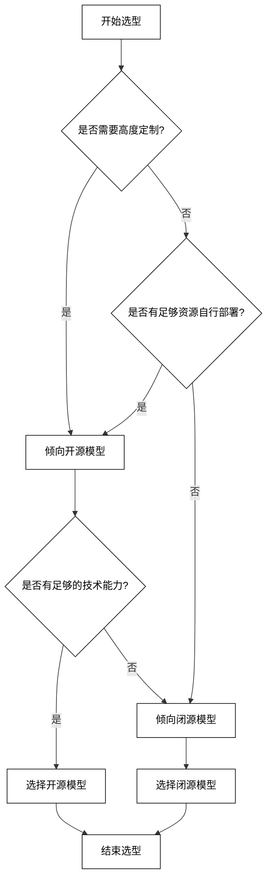

# 第4章：LLM 集成与优化

## 4.1 LLM 选型

选择合适的 LLM 对于 AI Agent 的性能至关重要。选型需要考虑多个因素，包括模型能力、资源需求、部署限制等。

### 4.1.1 开源 vs 闭源模型

开源和闭源模型各有优缺点，选择时需要权衡多个因素。

开源模型优势：
1. 可定制性强
2. 成本可控
3. 社区支持
4. 透明度高

闭源模型优势：
1. 通常性能更优
2. 持续更新
3. 技术支持
4. 易于使用

比较表格：

| 特性 | 开源模型 | 闭源模型 |
|------|----------|----------|
| 成本 | 低（主要是计算成本） | 高（API 调用费用） |
| 定制化 | 高 | 低 |
| 部署灵活性 | 高 | 低 |
| 性能 | 相对较低 | 通常较高 |
| 隐私控制 | 高 | 低 |
| 维护成本 | 高 | 低 |

选型决策流程：



### 4.1.2 通用模型 vs 领域特定模型

选择通用模型还是领域特定模型取决于应用场景和需求。

通用模型特点：
1. 适用范围广
2. 知识面广
3. 迁移学习能力强

领域特定模型特点：
1. 在特定领域表现优异
2. 专业术语理解准确
3. 通常规模较小，部署更轻量

选择标准：
- 如果应用涉及多个领域或需要广泛的知识，选择通用模型
- 如果应用聚焦于特定专业领域，选择领域特定模型
- 考虑计算资源限制和部署环境

### 4.1.3 性能与资源需求评估

评估 LLM 的性能和资源需求是选型过程中的关键步骤。

评估指标：
1. 准确性：在特定任务上的表现
2. 响应时间：生成回复的速度
3. 吞吐量：单位时间内处理的请求数
4. 内存占用：运行时的内存需求
5. 计算需求：所需的 GPU/CPU 资源
6. 存储需求：模型权重和相关数据的存储空间

评估方法：
1. 基准测试：使用标准数据集进行性能评估
2. A/B 测试：在实际场景中比较不同模型的表现
3. 负载测试：评估在高并发情况下的性能
4. 资源监控：在典型工作负载下监控资源使用情况

性能评估脚本示例：

```python
import time
import psutil
import torch
from transformers import AutoModelForCausalLM, AutoTokenizer

def evaluate_model_performance(model_name, input_text, num_iterations=100):
    tokenizer = AutoTokenizer.from_pretrained(model_name)
    model = AutoModelForCausalLM.from_pretrained(model_name)
    
    # 移动模型到 GPU（如果可用）
    device = torch.device("cuda" if torch.cuda.is_available() else "cpu")
    model.to(device)

    # 准确性评估（这里需要根据具体任务设计评估方法）
    # 这里仅作为示例，实际应用中需要更复杂的评估逻辑
    inputs = tokenizer(input_text, return_tensors="pt").to(device)
    
    # 性能评估
    start_time = time.time()
    memory_start = psutil.virtual_memory().used

    for _ in range(num_iterations):
        with torch.no_grad():
            outputs = model.generate(**inputs, max_length=50)

    end_time = time.time()
    memory_end = psutil.virtual_memory().used

    # 计算指标
    avg_response_time = (end_time - start_time) / num_iterations
    memory_usage = memory_end - memory_start
    
    return {
        "model_name": model_name,
        "avg_response_time": avg_response_time,
        "memory_usage": memory_usage,
        "device": device.type
    }

# 使用示例
model_name = "gpt2"  # 或其他模型名称
input_text = "Translate the following English text to French: 'Hello, how are you?'"

results = evaluate_model_performance(model_name, input_text)
print(f"Model: {results['model_name']}")
print(f"Average Response Time: {results['avg_response_time']:.4f} seconds")
print(f"Memory Usage: {results['memory_usage'] / (1024 * 1024):.2f} MB")
print(f"Device: {results['device']}")
```

这个脚本提供了一个基本框架来评估 LLM 的性能和资源需求。在实际应用中，你可能需要扩展这个脚本以包含更多的评估指标，如准确性、吞吐量等，并根据特定任务调整评估方法。

## 4.2 LLM 微调技术

微调是适应 LLM 到特定任务或领域的关键技术。不同的微调方法适用于不同的场景和需求。

### 4.2.1 全量微调

全量微调涉及更新模型的所有参数。这种方法可以显著提高模型在特定任务上的性能，但需要大量的计算资源和数据。

全量微调步骤：
1. 准备任务特定的数据集
2. 设置适当的学习率和其他超参数
3. 在整个预训练模型上进行反向传播
4. 定期评估模型性能并保存检查点

全量微调示例代码（使用 Hugging Face Transformers）：

```python
from transformers import AutoModelForSequenceClassification, AutoTokenizer, Trainer, TrainingArguments
from datasets import load_dataset

# 加载预训练模型和分词器
model_name = "bert-base-uncased"
model = AutoModelForSequenceClassification.from_pretrained(model_name, num_labels=2)
tokenizer = AutoTokenizer.from_pretrained(model_name)

# 准备数据集
dataset = load_dataset("imdb")
def tokenize_function(examples):
    return tokenizer(examples["text"], padding="max_length", truncation=True)

tokenized_datasets = dataset.map(tokenize_function, batched=True)

# 设置训练参数
training_args = TrainingArguments(
    output_dir="./results",
    num_train_epochs=3,
    per_device_train_batch_size=8,
    per_device_eval_batch_size=8,
    warmup_steps=500,
    weight_decay=0.01,
    logging_dir="./logs",
)

# 初始化 Trainer
trainer = Trainer(
    model=model,
    args=training_args,
    train_dataset=tokenized_datasets["train"],
    eval_dataset=tokenized_datasets["test"],
)

# 开始微调
trainer.train()

# 保存微调后的模型
model.save_pretrained("./fine_tuned_model")
tokenizer.save_pretrained("./fine_tuned_model")
```

### 4.2.2 适配器微调

适配器微调是一种参数高效的微调方法，它只添加和训练少量的新参数，同时保持大部分预训练权重不变。

适配器微调的优势：
1. 参数高效，减少存储需求
2. 计算高效，加快训练速度
3. 可以为不同任务训练多个适配器

适配器微调示例（使用 AdapterHub）：

```python
from transformers import AutoModelForSequenceClassification, AutoTokenizer
from datasets import load_dataset
from adapters import AdapterType, AdapterConfig, load_adapter, add_adapter, AutoAdapterModel

# 加载预训练模型和分词器
model_name = "bert-base-uncased"
model = AutoAdapterModel.from_pretrained(model_name)
tokenizer = AutoTokenizer.from_pretrained(model_name)

# 添加适配器
adapter_name = "sentiment_adapter"
model.add_adapter(adapter_name, AdapterType.TEXT_TASK)

# 激活适配器
model.set_active_adapters(adapter_name)

# 准备数据集
dataset = load_dataset("imdb")
def tokenize_function(examples):
    return tokenizer(examples["text"], padding="max_length", truncation=True)

tokenized_datasets = dataset.map(tokenize_function, batched=True)

# 设置训练参数
from transformers import TrainingArguments, AdapterTrainer

training_args = TrainingArguments(
    output_dir="./adapter_results",
    num_train_epochs=3,
    per_device_train_batch_size=8,
    per_device_eval_batch_size=8,
    warmup_steps=500,
    weight_decay=0.01,
    logging_dir="./adapter_logs",
)

# 初始化 AdapterTrainer
trainer = AdapterTrainer(
    model=model,
    args=training_args,
    train_dataset=tokenized_datasets["train"],
    eval_dataset=tokenized_datasets["test"],
)

# 开始微调
trainer.train()

# 保存微调后的适配器
model.save_adapter("./fine_tuned_adapter", adapter_name)
```

### 4.2.3 提示微调

提示微调（Prompt Tuning）是一种更加轻量级的微调方法，它通过学习任务特定的连续提示嵌入来适应不同任务。

提示微调的特点：
1. 极其参数高效，每个任务只需要很少的参数
2. 保持原始模型不变，便于多任务学习
3. 可以快速适应新任务

提示微调示例（使用 OpenPrompt 库）：

```python
from openprompt import PromptForClassification
from openprompt.plms import load_plm
from openprompt.prompts import SoftTemplate
from openprompt.data_utils import InputExample
from openprompt.data_utils.data_sampler import FewShotSampler

# 加载预训练模型
plm, tokenizer, model_config, WrapperClass = load_plm("bert", "bert-base-cased")

# 定义软模板
soft_template = SoftTemplate(
    model=plm,
    text='{"placeholder":"text_a"} It was {"mask"}.',
    tokenizer=tokenizer,
)

# 准备数据
dataset = [
    InputExample(guid=0, text_a="The movie is great!", label=1),
    InputExample(guid=1, text_a="The film was boring.", label=0),
    # 添加更多样本...
]

# 创建few-shot采样器
sampler = FewShotSampler(num_examples_per_label=16, also_sample_dev=True)
train_dataset, dev_dataset = sampler(dataset)

# 创建PromptForClassification模型
prompt_model = PromptForClassification(
    template=soft_template,
    plm=plm,
    verbalizer=None  # 这里使用默认的verbalizer
)

# 训练
from openprompt import PromptDataLoader
train_dataloader = PromptDataLoader(dataset=train_dataset, template=soft_template, tokenizer=tokenizer, 
    tokenizer_wrapper_class=WrapperClass, max_seq_length=256, decoder_max_length=3, 
    batch_size=4, shuffle=True, teacher_forcing=False, predict_eos_token=False,
    truncate_method="head")

from transformers import  AdamW, get_linear_schedule_with_warmup
loss_func = torch.nn.CrossEntropyLoss()
no_decay = ['bias', 'LayerNorm.weight']
optimizer_grouped_parameters = [
    {'params': [p for n, p in prompt_model.named_parameters() if not any(nd in n for nd in no_decay)], 'weight_decay': 0.01},
    {'params': [p for n, p in prompt_model.named_parameters() if any(nd in n for nd in no_decay)], 'weight_decay': 0.0}
]
optimizer = AdamW(optimizer_grouped_parameters, lr=1e-4)

for epoch in range(3):
    tot_loss = 0 
    for step, inputs in enumerate(train_dataloader):
        logits = prompt_model(inputs)
        labels = inputs['label']
        loss = loss_func(logits, labels)
        loss.backward()
        tot_loss += loss.item()
        optimizer.step()
        optimizer.zero_grad()
    print(f"Epoch {epoch}, Loss: {tot_loss}")

# 保存微调后的模板
torch.save(soft_template.state_dict(), "./fine_tuned_prompt.pt")
```

这些微调技术为在不同场景下适应 LLM 提供了灵活的选择。全量微调适用于有大量数据和计算资源的情况；适配器微调在保持模型性能的同时大大减少了参数量和计算需求；提示微调则提供了一种极其轻量级的方法，特别适合快速适应新任务或领域。在实际应用中，应根据具体需求、可用资源和性能要求选择合适的微调策略。

## 4.3 LLM 加速技术

随着 LLM 规模的不断增大，如何在有限的计算资源下实现高效推理成为了一个关键挑战。以下是几种常用的 LLM 加速技术：

### 4.3.1 模型量化

模型量化是将模型参数从高精度（如 float32）转换为低精度（如 int8 或更低）的技术，可以显著减少模型大小和推理时间，同时保持性能相对稳定。

量化类型：
1. 后训练量化（Post-training Quantization, PTQ）
2. 量化感知训练（Quantization-Aware Training, QAT）

量化示例（使用 PyTorch）：

```python
import torch
from transformers import AutoModelForCausalLM, AutoTokenizer

# 加载模型
model_name = "gpt2"
model = AutoModelForCausalLM.from_pretrained(model_name)
tokenizer = AutoTokenizer.from_pretrained(model_name)

# 动态量化
quantized_model = torch.quantization.quantize_dynamic(
    model, {torch.nn.Linear}, dtype=torch.qint8
)

# 比较模型大小
def get_model_size(model):
    param_size = 0
    for param in model.parameters():
        param_size += param.nelement() * param.element_size()
    buffer_size = 0
    for buffer in model.buffers():
        buffer_size += buffer.nelement() * buffer.element_size()
    size_all_mb = (param_size + buffer_size) / 1024**2
    return size_all_mb

print(f"Original model size: {get_model_size(model):.2f} MB")
print(f"Quantized model size: {get_model_size(quantized_model):.2f} MB")

# 推理性能比较
input_text = "Once upon a time"
input_ids = tokenizer.encode(input_text, return_tensors="pt")

def measure_inference_time(model, input_ids, num_runs=100):
    start_time = torch.cuda.Event(enable_timing=True)
    end_time = torch.cuda.Event(enable_timing=True)
    
    start_time.record()
    for _ in range(num_runs):
        with torch.no_grad():
            output = model(input_ids)
    end_time.record()
    
    torch.cuda.synchronize()
    return start_time.elapsed_time(end_time) / num_runs

original_time = measure_inference_time(model, input_ids)
quantized_time = measure_inference_time(quantized_model, input_ids)

print(f"Original model inference time: {original_time:.2f} ms")
print(f"Quantized model inference time: {quantized_time:.2f} ms")
```

### 4.3.2 模型剪枝

模型剪枝通过移除模型中不重要的权重或神经元来减小模型大小和计算复杂度。

剪枝方法：
1. 权重剪枝：移除绝对值小于阈值的权重
2. 结构化剪枝：移除整个神经元或卷积核
3. 动态剪枝：在推理时动态决定激活哪些神经元

简单的权重剪枝示例：

```python
import torch
import torch.nn.utils.prune as prune

def prune_model(model, amount=0.3):
    for name, module in model.named_modules():
        if isinstance(module, torch.nn.Linear):
            prune.l1_unstructured(module, name='weight', amount=amount)
            prune.remove(module, 'weight')
    return model

# 使用之前加载的模型
pruned_model = prune_model(model)

# 比较模型大小和性能
print(f"Pruned model size: {get_model_size(pruned_model):.2f} MB")
pruned_time = measure_inference_time(pruned_model, input_ids)
print(f"Pruned model inference time: {pruned_time:.2f} ms")
```

### 4.3.3 知识蒸馏

知识蒸馏是将大型模型（教师模型）的知识转移到小型模型（学生模型）的过程，旨在创建一个更小但性能相近的模型。

知识蒸馏步骤：
1. 训练大型教师模型
2. 使用教师模型生成软标签
3. 训练小型学生模型，同时学习真实标签和软标签

知识蒸馏示例：

```python
import torch
import torch.nn as nn
import torch.optim as optim
from transformers import AutoModelForSequenceClassification, AutoTokenizer

# 加载教师模型和学生模型
teacher_model = AutoModelForSequenceClassification.from_pretrained("bert-base-uncased", num_labels=2)
student_model = AutoModelForSequenceClassification.from_pretrained("distilbert-base-uncased", num_labels=2)
tokenizer = AutoTokenizer.from_pretrained("bert-base-uncased")

# 定义蒸馏损失函数
class DistillationLoss(nn.Module):
    def __init__(self, temperature=2.0):
        super().__init__()
        self.temperature = temperature
        self.kl_div = nn.KLDivLoss(reduction="batchmean")

    def forward(self, student_logits, teacher_logits, labels):
        soft_targets = nn.functional.softmax(teacher_logits / self.temperature, dim=-1)
        soft_prob = nn.functional.log_softmax(student_logits / self.temperature, dim=-1)
        soft_targets_loss = self.kl_div(soft_prob, soft_targets) * (self.temperature ** 2)
        
        hard_loss = nn.functional.cross_entropy(student_logits, labels)
        return soft_targets_loss + hard_loss

# 准备数据和优化器
train_data = [("This is a positive review", 1), ("This is a negative review", 0)]
optimizer = optim.Adam(student_model.parameters(), lr=1e-4)
distillation_loss = DistillationLoss()

# 训练循环
for epoch in range(3):
    for text, label in train_data:
        inputs = tokenizer(text, return_tensors="pt", padding=True, truncation=True)
        labels = torch.tensor([label])

        # 教师模型推理
        with torch.no_grad():
            teacher_outputs = teacher_model(**inputs, labels=labels)
            teacher_logits = teacher_outputs.logits

        # 学生模型训练
        student_outputs = student_model(**inputs, labels=labels)
        student_logits = student_outputs.logits

        loss = distillation_loss(student_logits, teacher_logits, labels)
        loss.backward()
        optimizer.step()
        optimizer.zero_grad()

    print(f"Epoch {epoch+1}, Loss: {loss.item()}")

# 保存蒸馏后的学生模型
student_model.save_pretrained("./distilled_model")
```

## 4.4 LLM 推理优化

除了模型本身的优化，推理过程的优化也是提高 LLM 效率的重要方面。

### 4.4.1 批处理推理

批处理推理通过同时处理多个输入来提高 GPU 利用率和整体吞吐量。

批处理推理示例：

```python
import torch
from transformers import AutoModelForCausalLM, AutoTokenizer

model_name = "gpt2"
model = AutoModelForCausalLM.from_pretrained(model_name)
tokenizer = AutoTokenizer.from_pretrained(model_name)

def batch_inference(model, tokenizer, texts, max_length=50):
    inputs = tokenizer(texts, return_tensors="pt", padding=True, truncation=True)
    with torch.no_grad():
        outputs = model.generate(**inputs, max_length=max_length)
    return tokenizer.batch_decode(outputs, skip_special_tokens=True)

# 使用示例
texts = [
    "Once upon a time",
    "In a galaxy far far away",
    "It was a dark and stormy night"
]

results = batch_inference(model, tokenizer, texts)
for text, result in zip(texts, results):
    print(f"Input: {text}")
    print(f"Output: {result}\n")
```

### 4.4.2 动态形状优化

动态形状优化通过调整输入序列的形状来减少不必要的计算，特别是在处理变长序列时。

实现动态形状优化通常需要在模型架构层面进行修改。以下是一个概念性的示例：

```python
import torch
import torch.nn as nn

class DynamicTransformerLayer(nn.Module):
    def __init__(self, d_model, nhead):
        super().__init__()
        self.self_attn = nn.MultiheadAttention(d_model, nhead)
        self.norm = nn.LayerNorm(d_model)

    def forward(self, x, mask=None):
        # 动态调整注意力计算
        seq_len = x.size(0)
        if mask is None:
            mask = torch.triu(torch.ones(seq_len, seq_len), diagonal=1).bool()
        
        attn_output, _ = self.self_attn(x, x, x, attn_mask=mask)
        return self.norm(x + attn_output)

# 使用动态 Transformer 层的模型
class DynamicTransformerModel(nn.Module):
    def __init__(self, num_layers, d_model, nhead):
        super().__init__()
        self.layers = nn.ModuleList([DynamicTransformerLayer(d_model, nhead) for _ in range(num_layers)])

    def forward(self, x):
        for layer in self.layers:
            x = layer(x)
        return x

# 使用示例
model = DynamicTransformerModel(num_layers=6, d_model=512, nhead=8)
input_seq = torch.rand(20, 32, 512)  # (seq_len, batch_size, d_model)
output = model(input_seq)
print(output.shape)
```

### 4.4.3 模型并行与流水线并行

对于大型 LLM，单个 GPU 可能无法容纳整个模型。模型并行和流水线并行是两种常用的分布式推理技术。

模型并行：将模型的不同层分布到不同的 GPU 上。
流水线并行：将输入数据分成多个微批次，在不同的 GPU 上以流水线方式处理。

以下是一个使用 PyTorch 实现简单模型并行的示例：

```python
import torch
import torch.nn as nn

class ParallelModel(nn.Module):
    def __init__(self):
        super().__init__()
        self.layer1 = nn.Linear(100, 100).to('cuda:0')
        self.layer2 = nn.Linear(100, 100).to('cuda:1')

    def forward(self, x):
        x = self.layer1(x)
        x = x.to('cuda:1')
        x = self.layer2(x)
        return x

model = ParallelModel()
input_data = torch.randn(32, 100).to('cuda:0')
output = model(input_data)
print(output.shape)
```

流水线并行通常需要更复杂的实现，通常使用专门的库如 Megatron-LM 或 DeepSpeed。

这些 LLM 加速和优化技术可以显著提高模型的推理效率，减少资源需求。在实际应用中，通常需要结合多种技术，并根据具体的硬件环境和性能需求进行调整。此外，随着硬件和软件技术的不断发展，新的优化方法也在不断涌现，如 FlashAttention、Continuous Batching 等，这些都为 LLM 的高效部署提供了更多可能性。

## 4.5 LLM 部署方案

LLM 的部署是将优化后的模型投入实际应用的关键步骤。根据不同的应用场景和资源限制，可以选择不同的部署方案。

### 4.5.1 本地部署

本地部署适用于对数据隐私要求高、需要低延迟响应或离线使用的场景。

优势：
1. 数据隐私保护
2. 低延迟
3. 离线使用
4. 完全控制

挑战：
1. 硬件要求高
2. 维护成本高
3. 扩展性受限

本地部署示例（使用 Flask 创建简单的 API 服务）：

```python
from flask import Flask, request, jsonify
from transformers import AutoModelForCausalLM, AutoTokenizer
import torch

app = Flask(__name__)

# 加载模型和分词器
model_name = "gpt2"
model = AutoModelForCausalLM.from_pretrained(model_name)
tokenizer = AutoTokenizer.from_pretrained(model_name)

@app.route('/generate', methods=['POST'])
def generate_text():
    data = request.json
    prompt = data.get('prompt', '')
    max_length = data.get('max_length', 50)

    input_ids = tokenizer.encode(prompt, return_tensors='pt')
    
    with torch.no_grad():
        output = model.generate(input_ids, max_length=max_length)
    
    generated_text = tokenizer.decode(output[0], skip_special_tokens=True)
    
    return jsonify({'generated_text': generated_text})

if __name__ == '__main__':
    app.run(host='0.0.0.0', port=5000)
```

### 4.5.2 云端部署

云端部署利用云服务提供商的基础设施，适合需要高可扩展性和灵活性的应用。

优势：
1. 高可扩展性
2. 灵活的资源分配
3. 低前期投资
4. 易于管理和更新

挑战：
1. 数据隐私concerns
2. 网络延迟
3. 持续的运营成本

云端部署示例（使用 AWS Lambda 和 API Gateway）：

```python
import json
import boto3
from transformers import AutoModelForCausalLM, AutoTokenizer

# 初始化模型和分词器
model_name = "gpt2"
model = AutoModelForCausalLM.from_pretrained(model_name)
tokenizer = AutoTokenizer.from_pretrained(model_name)

def lambda_handler(event, context):
    # 解析输入
    body = json.loads(event['body'])
    prompt = body.get('prompt', '')
    max_length = body.get('max_length', 50)

    # 生成文本
    input_ids = tokenizer.encode(prompt, return_tensors='pt')
    output = model.generate(input_ids, max_length=max_length)
    generated_text = tokenizer.decode(output[0], skip_special_tokens=True)

    # 返回结果
    return {
        'statusCode': 200,
        'body': json.dumps({'generated_text': generated_text})
    }
```

### 4.5.3 边缘计算部署

边缘计算部署将 LLM 部署在靠近数据源的位置，适合需要实时处理和低延迟的应用场景。

优势：
1. 低延迟
2. 减少带宽使用
3. 增强数据隐私和安全性
4. 支持离线操作

挑战：
1. 硬件资源限制
2. 模型大小限制
3. 更新和维护复杂

边缘部署示例（使用 TensorFlow Lite 进行模型转换和部署）：

```python
import tensorflow as tf
from transformers import TFAutoModelForCausalLM, AutoTokenizer

# 加载模型和分词器
model_name = "gpt2"
model = TFAutoModelForCausalLM.from_pretrained(model_name)
tokenizer = AutoTokenizer.from_pretrained(model_name)

# 创建一个简单的生成函数
def generate_text(prompt, max_length=50):
    input_ids = tokenizer.encode(prompt, return_tensors='tf')
    output = model.generate(input_ids, max_length=max_length)
    return tokenizer.decode(output[0], skip_special_tokens=True)

# 转换为 TensorFlow Lite 模型
converter = tf.lite.TFLiteConverter.from_keras_model(model)
converter.optimizations = [tf.lite.Optimize.DEFAULT]
tflite_model = converter.convert()

# 保存 TensorFlow Lite 模型
with open('gpt2_model.tflite', 'wb') as f:
    f.write(tflite_model)

# 加载和使用 TensorFlow Lite 模型
interpreter = tf.lite.Interpreter(model_path="gpt2_model.tflite")
interpreter.allocate_tensors()

input_details = interpreter.get_input_details()
output_details = interpreter.get_output_details()

def generate_text_tflite(prompt, max_length=50):
    input_ids = tokenizer.encode(prompt, return_tensors='tf')
    interpreter.set_tensor(input_details[0]['index'], input_ids)
    interpreter.invoke()
    output = interpreter.get_tensor(output_details[0]['index'])
    return tokenizer.decode(output[0], skip_special_tokens=True)

# 使用示例
prompt = "Once upon a time"
generated_text = generate_text_tflite(prompt)
print(generated_text)
```

选择合适的部署方案需要考虑多个因素，包括：

1. 性能需求：如响应时间、吞吐量等
2. 资源限制：如可用的计算资源、内存、存储等
3. 安全性和隐私要求
4. 可扩展性需求
5. 成本考虑
6. 维护和更新的便利性

在实际应用中，可能需要结合多种部署方案。例如，可以在边缘设备上部署小型模型进行初步处理，复杂任务再转发到云端的大型模型处理。或者使用联邦学习技术，在保护数据隐私的同时利用分布式设备的计算能力。

此外，随着技术的发展，新的部署方案不断涌现，如使用专门的 AI 加速硬件（如 Google的 TPU、NVIDIA 的 TensorRT）、基于 WebGPU 的浏览器内 LLM 部署等。这些新技术为 LLM 的高效部署提供了更多可能性。

在选择和实施部署方案时，还需要考虑监控、日志记录、版本控制、A/B测试等运维aspects，以确保 LLM 在生产环境中的稳定运行和持续优化。同时，制定适当的更新策略，包括模型更新、知识库更新等，也是保持 LLM 长期有效性的关键。

