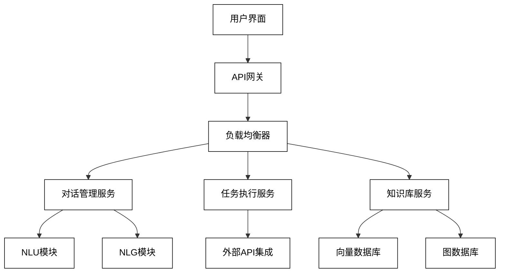

# 第三部分：AI Agent 应用开发

# 第7章：智能助手开发实践

智能助手是 AI Agent 技术的一个典型应用，它能够理解用户需求，提供个性化服务，并执行各种任务。本章将详细介绍智能助手的开发过程。

## 7.1 需求分析与系统设计

### 7.1.1 用户需求调研

用户需求调研是开发过程的第一步，它帮助我们了解目标用户群体及其期望。

调研方法：
1. 问卷调查
2. 用户访谈
3. 竞品分析
4. 用户行为数据分析

示例（简单的用户需求调查问卷）：

```python
class UserSurvey:
    def __init__(self):
        self.questions = [
            "What tasks would you like an AI assistant to help with?",
            "How important is personalization in an AI assistant? (1-5)",
            "What concerns do you have about using an AI assistant?",
            "Which features are most important to you? (e.g., voice control, multi-language support)",
            "How often would you use an AI assistant?"
        ]
        self.responses = []

    def conduct_survey(self):
        for question in self.questions:
            response = input(f"{question}\n> ")
            self.responses.append(response)

    def analyze_results(self):
        # 简单的结果分析
        print("Survey Results:")
        for question, response in zip(self.questions, self.responses):
            print(f"Q: {question}")
            print(f"A: {response}\n")

# 使用示例
survey = UserSurvey()
survey.conduct_survey()
survey.analyze_results()
```

### 7.1.2 功能模块划分

基于用户需求，我们可以将智能助手的功能划分为不同的模块。

主要模块：
1. 自然语言理解（NLU）
2. 对话管理
3. 任务执行
4. 自然语言生成（NLG）
5. 用户管理
6. 知识库

模块划分示例：

```python
class IntelligentAssistant:
    def __init__(self):
        self.nlu_module = NLUModule()
        self.dialogue_manager = DialogueManager()
        self.task_executor = TaskExecutor()
        self.nlg_module = NLGModule()
        self.user_manager = UserManager()
        self.knowledge_base = KnowledgeBase()

    def process_input(self, user_input):
        # 1. 自然语言理解
        intent, entities = self.nlu_module.understand(user_input)
        
        # 2. 对话管理
        dialogue_state = self.dialogue_manager.update_state(intent, entities)
        
        # 3. 任务执行
        task_result = self.task_executor.execute_task(dialogue_state)
        
        # 4. 自然语言生成
        response = self.nlg_module.generate_response(task_result)
        
        return response

class NLUModule:
    def understand(self, user_input):
        # 实现NLU逻辑
        pass

class DialogueManager:
    def update_state(self, intent, entities):
        # 实现对话状态更新逻辑
        pass

class TaskExecutor:
    def execute_task(self, dialogue_state):
        # 实现任务执行逻辑
        pass

class NLGModule:
    def generate_response(self, task_result):
        # 实现响应生成逻辑
        pass

class UserManager:
    def manage_user(self, user_id):
        # 实现用户管理逻辑
        pass

class KnowledgeBase:
    def query(self, question):
        # 实现知识查询逻辑
        pass
```

### 7.1.3 系统架构设计

系统架构设计决定了智能助手的整体结构和各个组件之间的交互方式。

主要考虑因素：
1. 可扩展性
2. 模块化
3. 性能
4. 安全性
5. 部署便利性

系统架构示意图：



## 7.2 对话流程设计

### 7.2.1 多轮对话管理

多轮对话管理是处理跨越多个交互的复杂对话的关键。

实现方法：
1. 状态机
2. 基于框架的方法
3. 神经网络模型

示例（使用简单的状态机进行多轮对话管理）：

```python
class DialogueStateMachine:
    def __init__(self):
        self.state = "INIT"
        self.slots = {}

    def transition(self, user_input):
        if self.state == "INIT":
            self.state = "GREETING"
            return "Hello! How can I assist you today?"
        
        elif self.state == "GREETING":
            self.state = "TASK_SELECTION"
            return "I can help with scheduling, weather information, or general queries. What would you like to do?"
        
        elif self.state == "TASK_SELECTION":
            if "schedule" in user_input.lower():
                self.state = "SCHEDULING"
                return "Sure, I can help you schedule something. What date are you looking at?"
            elif "weather" in user_input.lower():
                self.state = "WEATHER_QUERY"
                return "I'd be happy to check the weather for you. Which city are you interested in?"
            else:
                self.state = "GENERAL_QUERY"
                return "I'll do my best to answer your question. What would you like to know?"
        
        elif self.state == "SCHEDULING":
            self.slots['date'] = user_input
            self.state = "SCHEDULING_CONFIRMATION"
            return f"I've noted down {user_input} for scheduling. What time works best for you?"
        
        elif self.state == "WEATHER_QUERY":
            self.slots['city'] = user_input
            self.state = "WEATHER_CONFIRMATION"
            return f"I'll check the weather in {user_input}. Is that correct?"
        
        elif self.state == "GENERAL_QUERY":
            # Here you would typically call a knowledge base or search function
            self.state = "INIT"
            return "I'm sorry, I don't have specific information on that topic. Is there anything else I can help with?"
        
        else:
            self.state = "INIT"
            return "I'm not sure how to proceed. Can we start over?"

# 使用示例
dialogue_manager = DialogueStateMachine()

# 模拟对话
conversations = [
    "Hi there!",
    "I need to schedule a meeting",
    "Next Monday",
    "Can you tell me the weather?",
    "In New York",
    "What's the capital of France?"
]

for user_input in conversations:
    print(f"User: {user_input}")
    response = dialogue_manager.transition(user_input)
    print(f"Assistant: {response}\n")
```

### 7.2.2 意图识别与槽位填充

意图识别和槽位填充是理解用户输入的关键步骤。

实现方法：
1. 规则基础方法
2. 机器学习方法（如SVM, CRF）
3. 深度学习方法（如BERT, RNN）

示例（使用简单的关键词匹配进行意图识别和槽位填充）：

```python
import re

class IntentSlotRecognizer:
    def __init__(self):
        self.intents = {
            "schedule_meeting": r"schedule|book|set up.*meeting",
            "check_weather": r"weather|temperature|forecast",
            "general_query": r"what|how|why|when|where"
        }
        self.slots = {
            "date": r"(\d{4}-\d{2}-\d{2}|tomorrow|next \w+)",
            "time": r"(\d{1,2}:\d{2}|morning|afternoon|evening)",
            "city": r"in (\w+)"
        }

    def recognize(self, user_input):
        intent = self.identify_intent(user_input)
        filled_slots = self.fill_slots(user_input)
        return intent, filled_slots

    def identify_intent(self, user_input):
        for intent, pattern in self.intents.items():
            if re.search(pattern, user_input, re.IGNORECASE):
                return intent
        return "unknown"

    def fill_slots(self, user_input):
        filled_slots = {}
        for slot, pattern in self.slots.items():
            match = re.search(pattern, user_input, re.IGNORECASE)
            if match:
                filled_slots[slot] = match.group(1)
        return filled_slots

# 使用示例
recognizer = IntentSlotRecognizer()

# 测试不同的用户输入
test_inputs = [
    "Can you schedule a meeting for tomorrow afternoon?",
    "What's the weather like in New York?",
    "Tell me about the history of AI"
]

for user_input in test_inputs:
    intent, slots = recognizer.recognize(user_input)
    print(f"User Input: {user_input}")
    print(f"Recognized Intent: {intent}")
    print(f"Filled Slots: {slots}\n")
```

### 7.2.3 上下文理解与维护

上下文理解和维护对于进行连贯的对话至关重要。

实现方法：
1. 基于规则的上下文跟踪
2. 统计方法（如条件随机场）
3. 神经网络方法（如记忆网络）

示例（使用简单的基于字典的上下文管理器）：

```python
class ContextManager:
    def __init__(self):
        self.context = {}
        self.history = []
        self.max_history = 5

    def update_context(self, intent, slots):
        self.context.update(slots)
        self.context['last_intent'] = intent
        self.history.append((intent, slots))
        if len(self.history) > self.max_history:
            self.history.pop(0)

    def get_context(self):
        return self.context

    def get_history(self):
        return self.history

    def clear_context(self):
        self.context = {}
        self.history = []

# 使用示例
context_manager = ContextManager()

# 模拟一系列交互
interactions = [
    ("schedule_meeting", {"date": "2023-06-15", "time": "14:00"}),
    ("check_weather", {"city": "New York"}),
    ("general_query", {}),
    ("schedule_meeting", {"time": "morning"})
]

for intent, slots in interactions:
    context_manager.update_context(intent, slots)
    print(f"Current Context: {context_manager.get_context()}")
    print(f"Interaction History: {context_manager.get_history()}\n")
```

这些组件共同工作，可以创建一个能够理解用户意图、维护对话上下文、并提供连贯响应的智能助手系统。在实际应用中，这些组件通常会使用更复杂的算法和模型，并且需要大量的训练数据来提高性能。此外，还需要考虑错误处理、异常情况的管理，以及与外部系统的集成等方面，以构建一个健壮和实用的智能助手。

## 7.3 知识库构建

知识库是智能助手回答用户问题和执行任务的基础。构建一个全面、准确的知识库对于提供高质量的服务至关重要。

### 7.3.1 领域知识收集

收集特定领域的知识是构建知识库的第一步。这可能涉及多种来源和方法。

收集方法：
1. 专家访谈
2. 文献研究
3. 网络爬虫
4. 公开数据集
5. 用户生成内容

示例（使用网络爬虫收集知识）：

```python
import requests
from bs4 import BeautifulSoup

class KnowledgeScraper:
    def __init__(self, base_url):
        self.base_url = base_url
        self.knowledge = []

    def scrape(self, num_pages):
        for i in range(1, num_pages + 1):
            url = f"{self.base_url}/page/{i}"
            response = requests.get(url)
            if response.status_code == 200:
                soup = BeautifulSoup(response.text, 'html.parser')
                articles = soup.find_all('article')
                for article in articles:
                    title = article.find('h2').text.strip()
                    content = article.find('div', class_='content').text.strip()
                    self.knowledge.append({
                        'title': title,
                        'content': content
                    })
            else:
                print(f"Failed to fetch page {i}")

    def get_knowledge(self):
        return self.knowledge

# 使用示例
scraper = KnowledgeScraper('https://example.com/knowledge-base')
scraper.scrape(5)  # 爬取5页
collected_knowledge = scraper.get_knowledge()
print(f"Collected {len(collected_knowledge)} knowledge items")
```

### 7.3.2 知识结构化与存储

将收集的知识转化为结构化形式并高效存储是构建可用知识库的关键步骤。

结构化方法：
1. 实体-关系模型
2. 本体构建
3. 知识图谱

存储技术：
1. 关系型数据库
2. 图数据库
3. 向量数据库

示例（使用 Neo4j 图数据库存储知识图谱）：

```python
from neo4j import GraphDatabase

class KnowledgeGraph:
    def __init__(self, uri, user, password):
        self.driver = GraphDatabase.driver(uri, auth=(user, password))

    def close(self):
        self.driver.close()

    def add_entity(self, entity_type, name, properties=None):
        with self.driver.session() as session:
            session.write_transaction(self._create_entity, entity_type, name, properties)

    def add_relation(self, start_entity, relation_type, end_entity):
        with self.driver.session() as session:
            session.write_transaction(self._create_relation, start_entity, relation_type, end_entity)

    @staticmethod
    def _create_entity(tx, entity_type, name, properties):
        properties_string = ', '.join([f"{k}: ${k}" for k in properties.keys()]) if properties else ""
        query = (
            f"CREATE (e:{entity_type} {{name: $name, {properties_string}}})"
        )
        tx.run(query, name=name, **properties)

    @staticmethod
    def _create_relation(tx, start_entity, relation_type, end_entity):
        query = (
            f"MATCH (a), (b) "
            f"WHERE a.name = $start_name AND b.name = $end_name "
            f"CREATE (a)-[r:{relation_type}]->(b)"
        )
        tx.run(query, start_name=start_entity, end_name=end_entity)

# 使用示例
kg = KnowledgeGraph("bolt://localhost:7687", "neo4j", "password")

# 添加实体
kg.add_entity("Person", "Alan Turing", {"birth_year": 1912, "field": "Computer Science"})
kg.add_entity("Concept", "Artificial Intelligence")
kg.add_entity("Organization", "University of Cambridge")

# 添加关系
kg.add_relation("Alan Turing", "CONTRIBUTED_TO", "Artificial Intelligence")
kg.add_relation("Alan Turing", "STUDIED_AT", "University of Cambridge")

kg.close()
```

### 7.3.3 知识更新机制

知识库需要定期更新以保持其准确性和相关性。

更新策略：
1. 定期批量更新
2. 实时增量更新
3. 用户反馈驱动更新
4. 自动化爬虫更新

示例（实现简单的知识更新机制）：

```python
import datetime

class KnowledgeBaseManager:
    def __init__(self):
        self.knowledge_base = {}
        self.update_log = []

    def add_knowledge(self, key, value):
        self.knowledge_base[key] = {
            'value': value,
            'last_updated': datetime.datetime.now(),
            'update_count': 1
        }
        self.log_update(key, 'add')

    def update_knowledge(self, key, value):
        if key in self.knowledge_base:
            self.knowledge_base[key]['value'] = value
            self.knowledge_base[key]['last_updated'] = datetime.datetime.now()
            self.knowledge_base[key]['update_count'] += 1
            self.log_update(key, 'update')
        else:
            self.add_knowledge(key, value)

    def get_knowledge(self, key):
        return self.knowledge_base.get(key, {}).get('value')

    def log_update(self, key, action):
        self.update_log.append({
            'key': key,
            'action': action,
            'timestamp': datetime.datetime.now()
        })

    def get_outdated_knowledge(self, days=30):
        threshold = datetime.datetime.now() - datetime.timedelta(days=days)
        return [key for key, data in self.knowledge_base.items() if data['last_updated'] < threshold]

# 使用示例
kb_manager = KnowledgeBaseManager()

# 添加知识
kb_manager.add_knowledge('AI', 'Artificial Intelligence is a branch of computer science...')
kb_manager.add_knowledge('ML', 'Machine Learning is a subset of AI...')

# 更新知识
kb_manager.update_knowledge('AI', 'Artificial Intelligence is the simulation of human intelligence in machines...')

# 获取知识
print(kb_manager.get_knowledge('AI'))

# 检查过期知识
outdated = kb_manager.get_outdated_knowledge(days=7)
print(f"Outdated knowledge items: {outdated}")
```

## 7.4 LLM 集成与优化

将大语言模型（LLM）集成到智能助手中可以显著提升其理解和生成能力。

### 7.4.1 模型选择与微调

选择合适的LLM并进行任务特定的微调是提高性能的关键。

选择标准：
1. 模型大小与计算资源
2. 预训练数据领域
3. 特定任务性能
4. 开源可用性

微调方法：
1. 全量微调
2. 适配器微调
3. 提示学习

示例（使用Hugging Face的Transformers库进行模型微调）：

```python
from transformers import AutoModelForCausalLM, AutoTokenizer, Trainer, TrainingArguments
from datasets import load_dataset

def fine_tune_model(model_name, dataset_name, output_dir):
    # 加载预训练模型和分词器
    model = AutoModelForCausalLM.from_pretrained(model_name)
    tokenizer = AutoTokenizer.from_pretrained(model_name)

    # 加载数据集
    dataset = load_dataset(dataset_name)

    # 数据预处理
    def preprocess_function(examples):
        return tokenizer(examples["text"], truncation=True, padding="max_length", max_length=512)

    tokenized_dataset = dataset.map(preprocess_function, batched=True)

    # 定义训练参数
    training_args = TrainingArguments(
        output_dir=output_dir,
        num_train_epochs=3,
        per_device_train_batch_size=8,
        per_device_eval_batch_size=8,
        warmup_steps=500,
        weight_decay=0.01,
        logging_dir="./logs",
    )

    # 初始化Trainer
    trainer = Trainer(
        model=model,
        args=training_args,
        train_dataset=tokenized_dataset["train"],
        eval_dataset=tokenized_dataset["test"],
    )

    # 开始微调
    trainer.train()

    # 保存微调后的模型
    model.save_pretrained(output_dir)
    tokenizer.save_pretrained(output_dir)

# 使用示例
fine_tune_model("gpt2", "wikipedia", "./fine_tuned_model")
```

### 7.4.2 提示工程最佳实践

提示工程是优化LLM输出的关键技术。

最佳实践：
1. 清晰具体的指令
2. 提供相关上下文
3. 使用示例（少样本学习）
4. 结构化输出指令
5. 迭代优化提示

示例（实现提示模板管理器）：

```python
class PromptTemplateManager:
    def __init__(self):
        self.templates = {}

    def add_template(self, name, template):
        self.templates[name] = template

    def get_template(self, name):
        return self.templates.get(name)

    def format_prompt(self, name, **kwargs):
        template = self.get_template(name)
        if template:
            return template.format(**kwargs)
        else:
            raise ValueError(f"Template '{name}' not found")

# 使用示例
prompt_manager = PromptTemplateManager()

# 添加提示模板
prompt_manager.add_template(
    "question_answering",
    "Context: {context}\n\nQuestion: {question}\n\nAnswer the question based on the given context. If the answer cannot be found in the context, say 'I don't have enough information to answer this question.'\n\nAnswer:"
)

prompt_manager.add_template(
    "text_summarization",
    "Summarize the following text in {num_sentences} sentences:\n\n{text}\n\nSummary:"
)

# 使用模板生成提示
qa_prompt = prompt_manager.format_prompt(
    "question_answering",
    context="The Earth is the third planet from the Sun and the only astronomical object known to harbor life.",
    question="What is the position of Earth in the solar system?"
)

summary_prompt = prompt_manager.format_prompt(
    "text_summarization",
    num_sentences=2,
    text="Artificial intelligence (AI) is intelligence demonstrated by machines, as opposed to natural intelligence displayed by animals including humans. AI research has been defined as the field of study of intelligent agents, which refers to any system that perceives its environment and takes actions that maximize its chance of achieving its goals."
)

print(qa_prompt)
print("\n" + "="*50 + "\n")
print(summary_prompt)
```

### 7.4.3 输出质量控制

确保LLM输出的质量和一致性是构建可靠智能助手的关键。

质量控制方法：
1. 输出过滤（如敏感内容、不适当语言）
2. 事实核查
3. 一致性检查
4. 人工审核

示例（实现简单的输出质量控制）：

```python
import re

class OutputQualityControl:
    def __init__(self):
        self.inappropriate_words = set(["badword1", "badword2", "badword3"])  # 示例不当词列表
        self.max_length = 1000  # 最大输出长度

    def filter_inappropriate_content(self, text):
        words = text.split()
        filtered_words = [word for word in words if word.lower() not in self.inappropriate_words]
        return ' '.join(filtered_words)

    def check_length(self, text):
        if len(text) > self.max_length:
            return text[:self.max_length] + "... (truncated)"
        return text

    def ensure_question_answered(self, question, answer):
        # 简单检查答案是否包含问题中的关键词
        question_keywords = set(re.findall(r'\w+', question.lower()))
        answer_keywords = set(re.findall(r'\w+', answer.lower()))
        if not question_keywords.intersection(answer_keywords):
            return answer + "\n\nNote: This answer may not directly address the question."
        return answer

    def process_output(self, question, raw_output):
        filtered_output = self.filter_inappropriate_content(raw_output)
        length_checked_output = self.check_length(filtered_output)
        final_output = self.ensure_question_answered(question, length_checked_output)
        return final_output

# 使用示例
qc = OutputQualityControl()

question = "What is the capital of France?"
raw_output = "The capital of France is Paris. badword1 It's a beautiful city known for its art, culture, and cuisine."

processed_output = qc.process_output(question, raw_output)
print(processed_output)
```

这些组件和技术共同工作，可以创建一个强大的、基于LLM的智能助手系统。在实际应用中，还需要考虑模型的部署、性能优化、多语言支持、以及与其他系统的集成等方面。此外，持续的监控、评估和改进也是保持系统效能的关键。